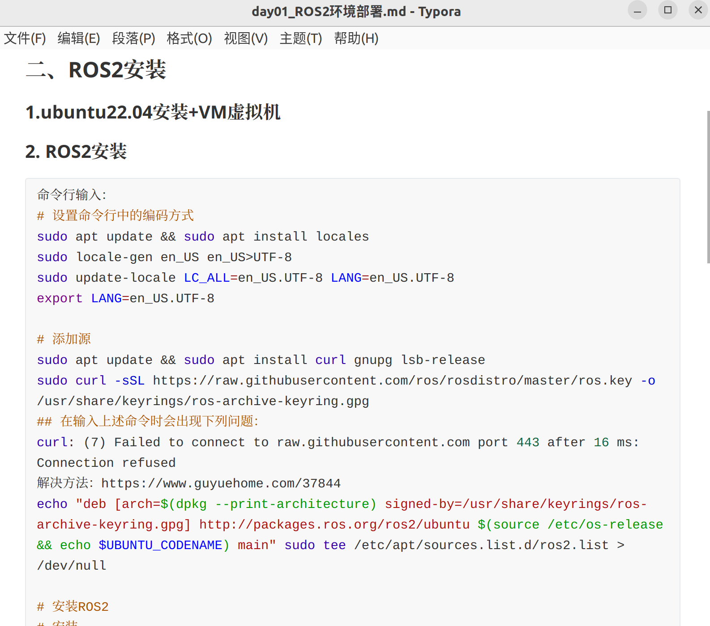
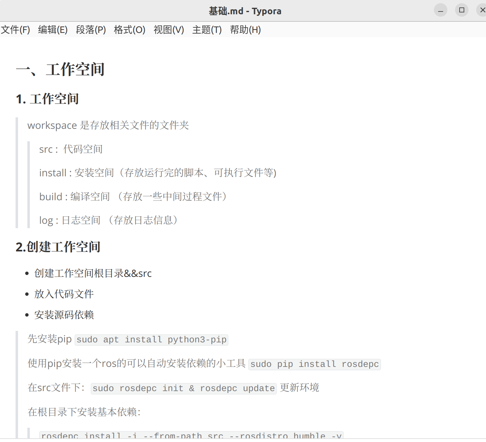
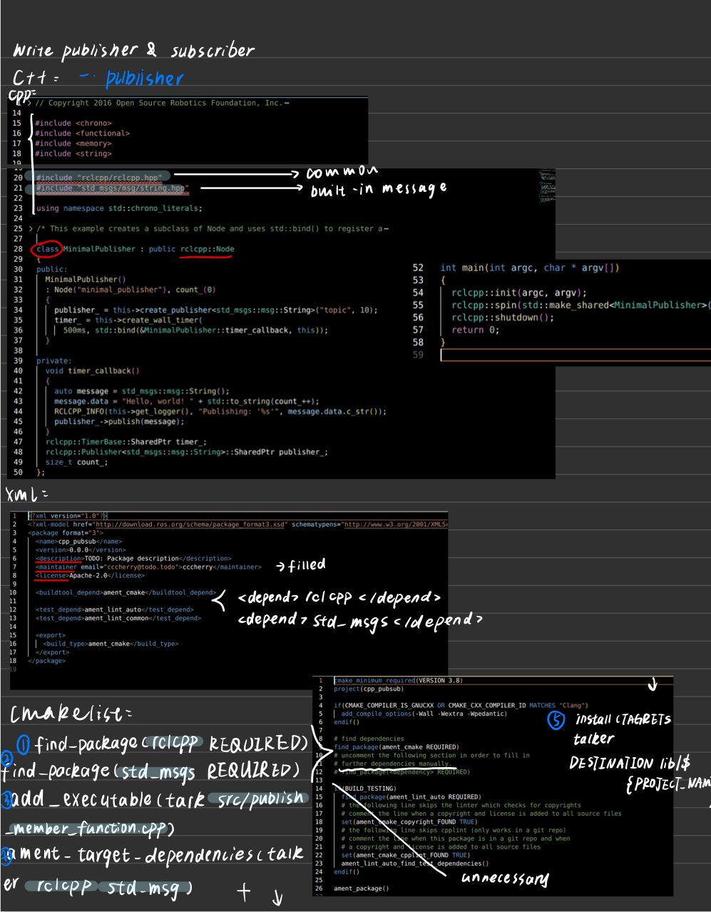
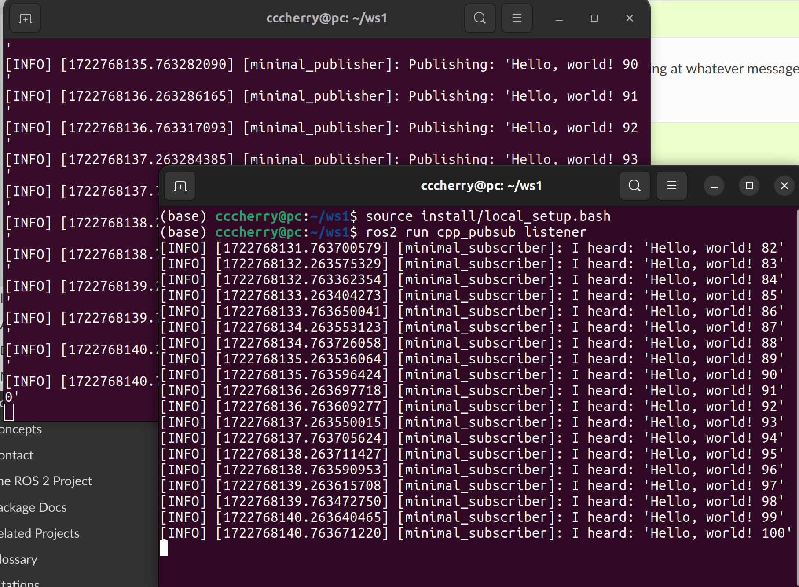
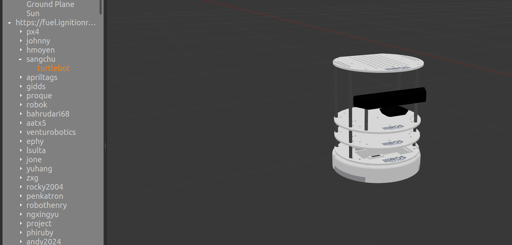

# Report of LookatTurtle team

> teammates: 陈琳 焦烁月
>
> task: 使用turtle轮式机器人，实现自主定位和自主导航
>
> env: ros+Gazebo+turtle

#### Step1 环境部署及搭建(7.20-7.24)

> 方式1：虚拟机+ROS2+WSL

> 方式二：Ubuntu命令行安装Ros2

#### Step2 ROS基础概念和操作学习(7.25-8.2)

##### 1）学习笔记

> 完整笔记详见笔记文件夹

##### 2）基础操作熟悉

#### Step3 Gazebo创建turtule机器人及其环境搭建(8.3-)

##### 1）创建机器人&URDF设置基本信息

###### 

##### 2）路障环境搭建

#### Step4 算法实现自主定位

#### Step5 算法实现自主导航