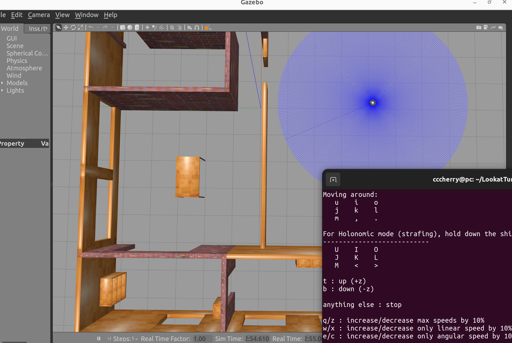
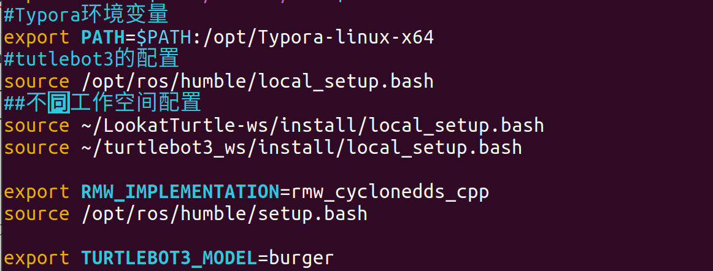
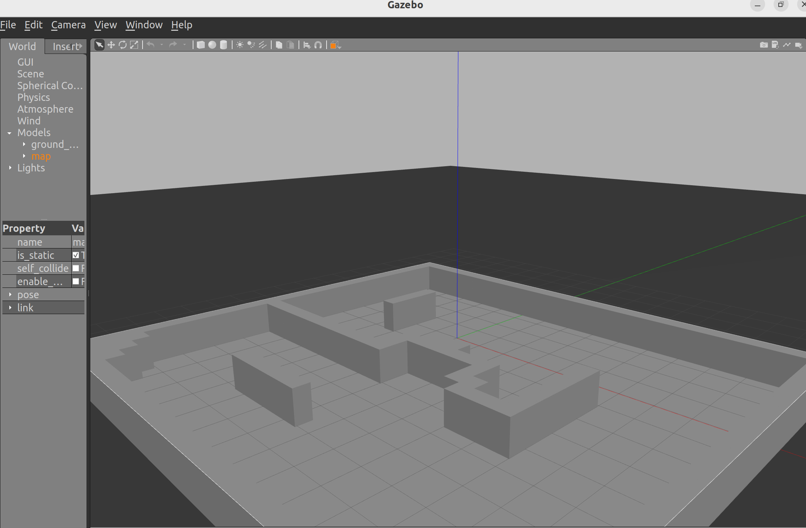
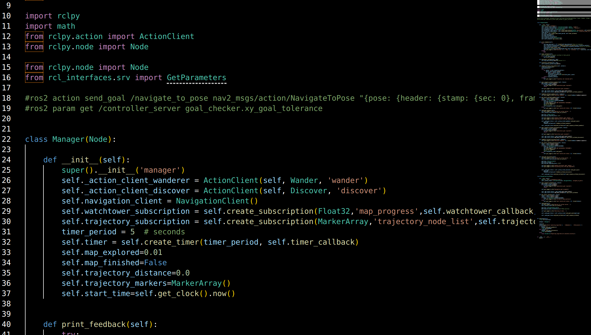
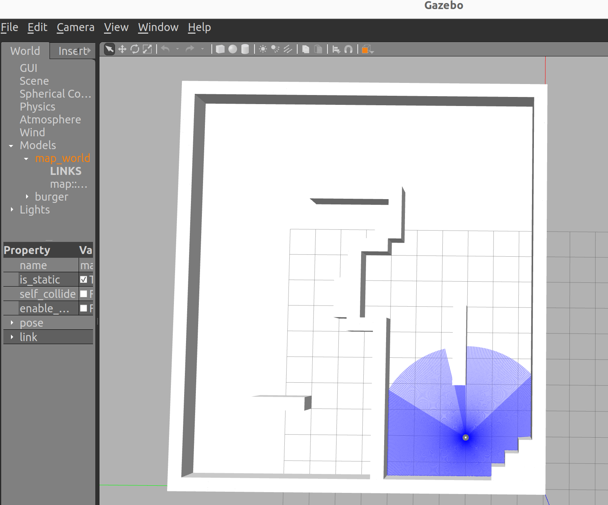
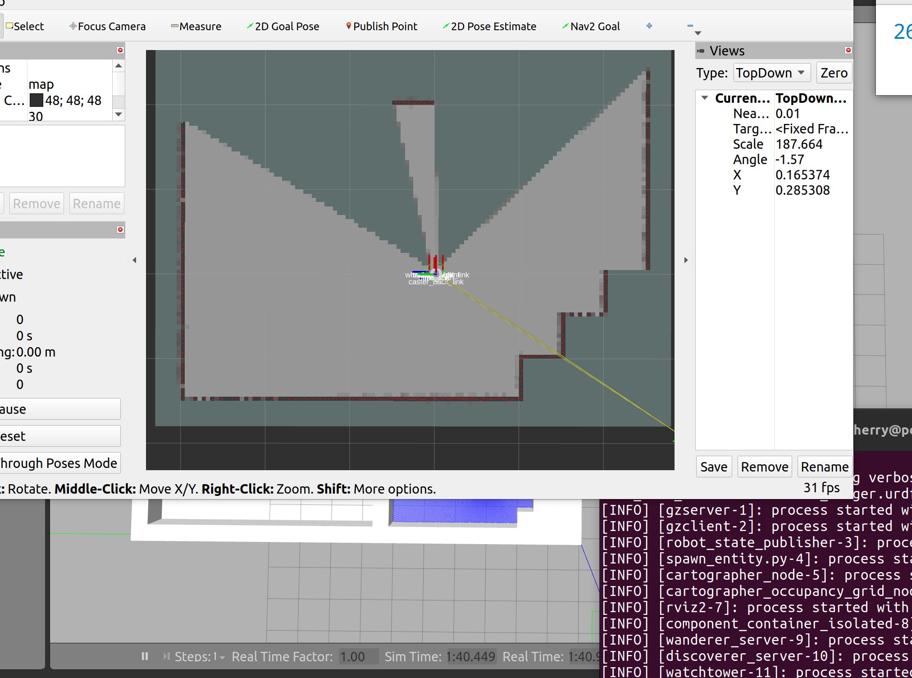
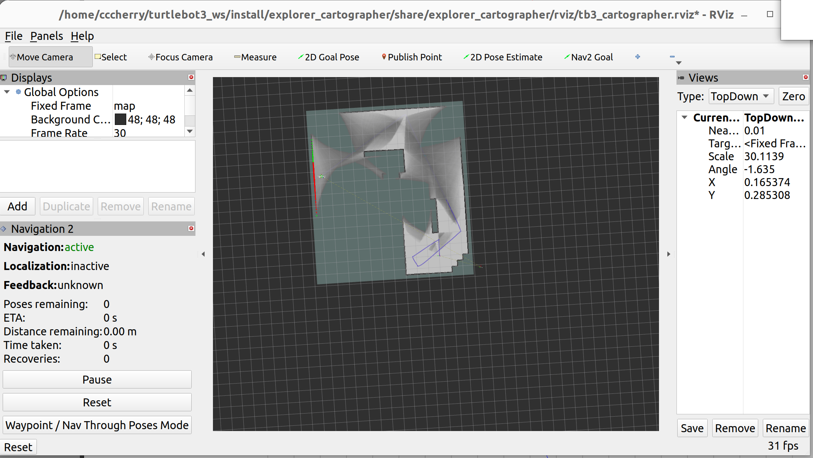
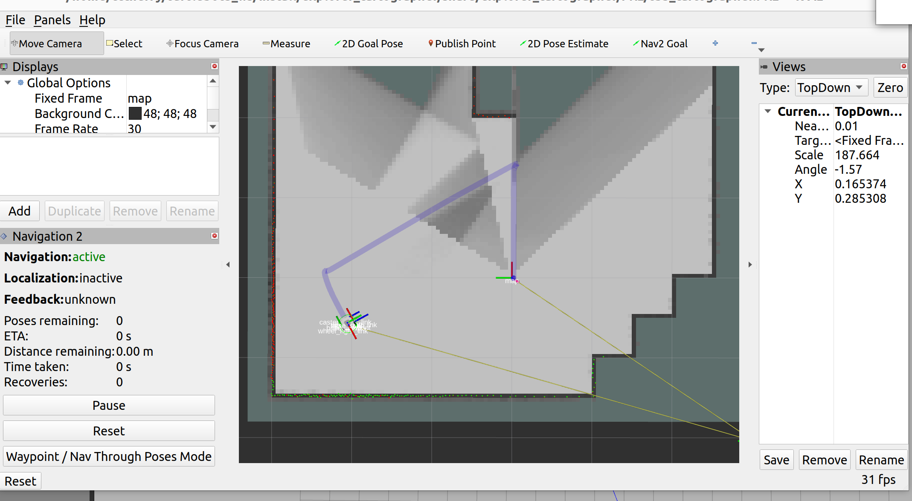
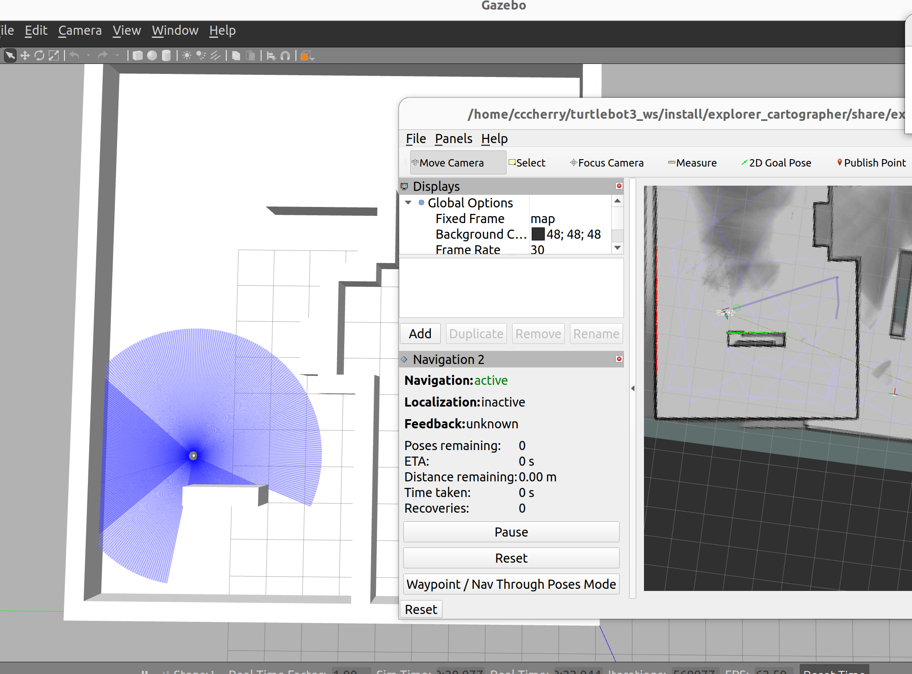
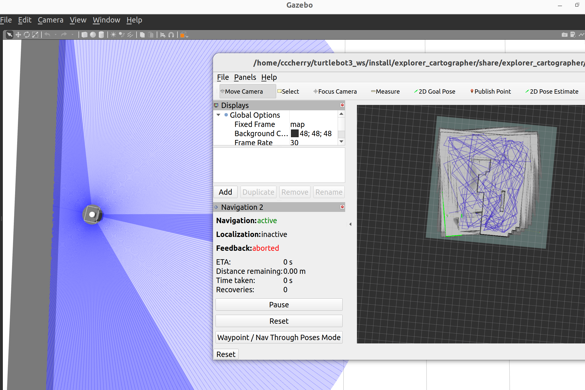

# Report of LookatTurtle team

> teammates: 陈琳 焦烁月
>
> task: 使用turtle轮式机器人，实现自主定位和自主导航
>
> env: ros+Gazebo+turtle


#### Step1 环境部署及搭建(7.20-7.24)

> 方式1：虚拟机+ROS2+WSL


> 方式二：Ubuntu命令行安装Ros2


#### Step2 ROS基础概念和操作学习(7.25-8.2)

##### 1）学习笔记


> 完整笔记详见笔记文件夹


##### 2）基础操作熟悉


#### Step3 Gazebo创建turtulebot3机器人及其环境搭建(8.3-8.15)

##### prerequistes:

```
sudo apt install python3-colcon-common-extensions
```

Install Gazebo:

```
sudo apt install gazebo
```

Install Python libraries:

```
sudo apt install python3-pip
pip3 install pandas
```

Install slam_toolbox

```
sudo apt install ros-<ros2-distro>-slam-toolbox
```

##### 创建turtlrbot3机器人

[可根据自己的版本参考网址](https://emanual.robotis.com/docs/en/platform/turtlebot3/quick-start/#pc-setup)

```
sudo apt-get install ros-humble-turtlebot3-*
apt-get install ros-humble-gmapping 
apt-get install ros-humble-dwa-local-planner
```

##### Gazebo中测试机器人正常运行



```
roslaunch turtlebot3_gazebo turtlebot3_world.launch
```

##### 工作空间初始化

```
colcon build
source /opt/ros/humble/local_setup.bash
source ~/LookatTurtle_ws/install/local_setup.bash
```

并且修改bashrc文件（下图仅参考）




##### 使用Cartographer创建地图

[cartographer_ros官方网址](https://google-cartographer-ros.readthedocs.io/en/latest/compilation.html#system-requirements)

```
sudo apt install ros-humble-cartographer
sudo apt install ros-humble-cartographer-ros
```

创建好后Gazebo中显示如下：



#### 编写launch.py文件并编译



运行launch.py出现地图和turtlebot3：



##### 


#### Step4 Slam+Nav2实现自主导航

通过RViz或ROS 2命令行界面请求目标来移动机器人:

```
ros2 topic pub /goal_pose geometry_msgs/PoseStamped "{header: {stamp: {sec: 0}, frame_id: 'map'}, pose: {position: {x: 0.2, y: 0.0, z: 0.0}, orientation: {w: 1.0}}}"
```







最终结果：

