# windows 环境
## CLI
> MLC Chat CLI is the command line tool to run MLC-compiled LLMs out of the box interactively.

### 一、Install MLC-LLM Package
#### Build from Source
#### Step 1. Set up build dependency.
 To build from source, you need to ensure that the following build dependencies are satisfied:

+ CMake >= 3.24

+ Git

+ Rust and Cargo, required by Hugging Face’s tokenizer

+ One of the GPU runtimes:

    + CUDA >= 11.8 (NVIDIA GPUs)

    + Metal (Apple GPUs)

    + Vulkan (NVIDIA, AMD, Intel GPUs)

```
# make sure to start with a fresh environment
conda env remove -n mlc-chat-venv
# create the conda environment with build dependency
conda create -n mlc-chat-venv -c conda-forge \
    "cmake>=3.24" \
    rust \
    git \
    python=3.11
# enter the build environment
conda activate mlc-chat-venv
```
#### Step 2. Configure and build.
 A standard git-based workflow is recommended to download MLC LLM, after which you can specify build requirements with our lightweight config generation tool:
 ```
# clone from GitHub
git clone --recursive https://github.com/mlc-ai/mlc-llm.git && cd mlc-llm/
# create build directory
mkdir -p build && cd build
# generate build configuration
python ../cmake/gen_cmake_config.py
# build mlc_llm libraries
cmake .. && cmake --build . --parallel $(nproc) && cd ..
```
python ../cmake/gen_cmake_config.py
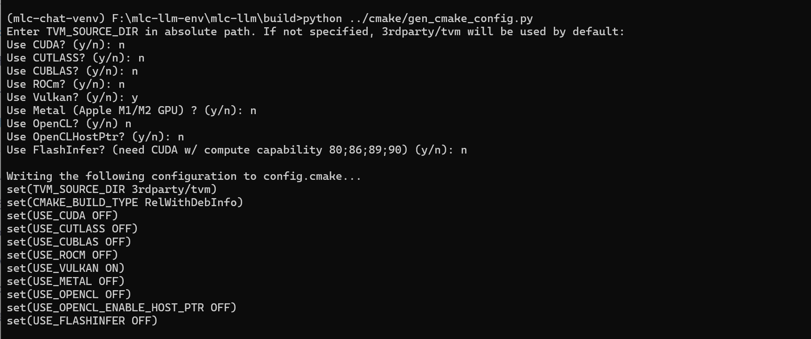
cmake ..（这步配置项目的构建环境应该是正确的，即使后面有一些failed。这些警告和错误提示是由于平台差异引起的，对于Windows平台上的构建过程是可以忽略的）
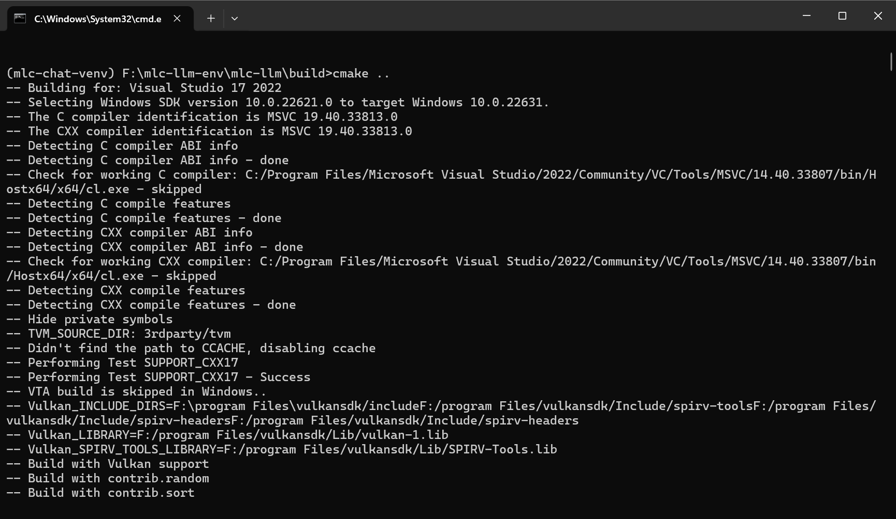
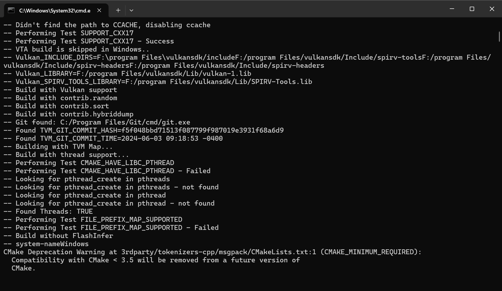
F:\mlc-llm-env\mlc-llm\build>cmake --build . --parallel 16

<font color="#dd0000">在后续操作中出现找不到mlc_llm.dll的错误，反推到这里出现了问题。但是这条命令可以正常执行，结果在build文件夹中创建了个debug文件夹。里面含有mlc_llm中唯一的mlc_llm.dll文件。后续'pip install -e .'操作中运行setup.py失败</font><br /> 
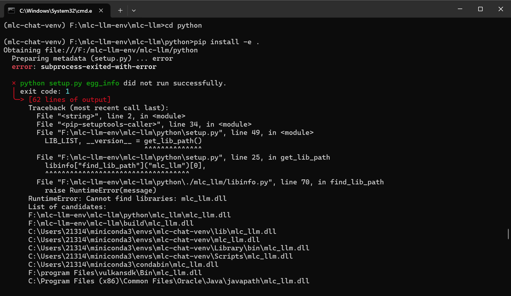
<font color="#dd0000">发现在libinfo.py中搜索的是release版本，于是给他手动填加了搜索debug，此命令可以顺利执行，但是后续'mlc_llm chat -h'时还是有问题。</font><br /> 
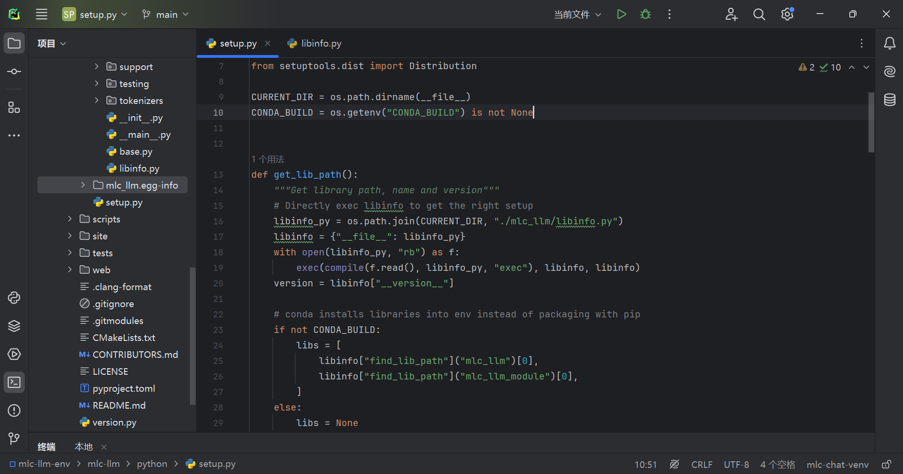
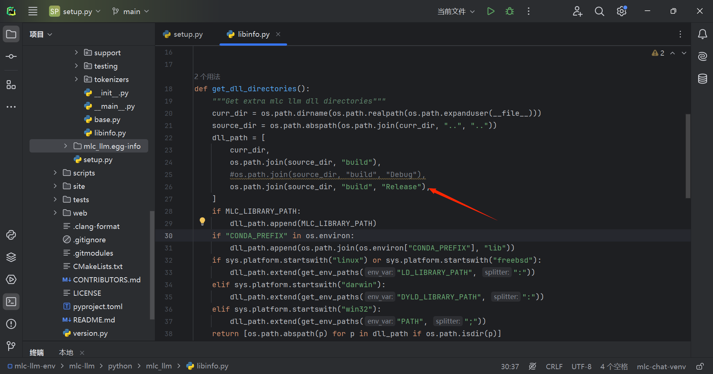
<font color="#dd0000">然后尝试重新指定生成release版本的'(mlc-chat-venv) F:\mlc-llm-env\mlc-llm\build>cmake -S F:/mlc-llm-env/mlc-llm -B F:/mlc-llm-env/mlc-llm/build -DCMAKE_BUILD_TYPE=Release'生成的还是debug，没有变。通过对比两个CMakeCache.txt文件里都是'CMAKE_BUILD_TYPE:UNINITIALIZED=Release
'没变。于是修改了CMakeLists.txt文件。</font><br /> 
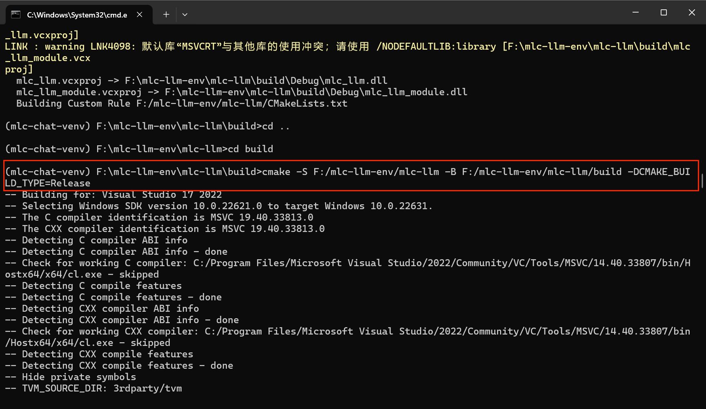
<font color="#dd0000">然后尝试重新指定生成release版本的'(mlc-chat-venv) 于是修改了CMakeLists.txt文件。强制设置构建类型为Release。再次cmake。</font><br /> 
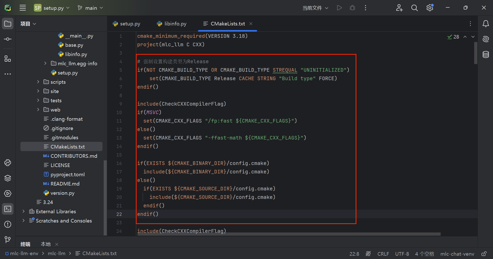
<font color="#dd0000">CMakeCache.txt文件确实变成release版本的，但是实际还是生成了debug文件夹，通过对比mlc_llm.dll二者文件大小，并没有发生变化。</font><br /> 
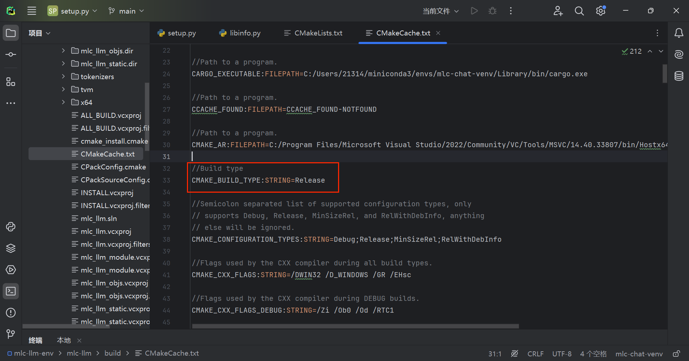
#### Step 3. Install via Python. 
We recommend that you install mlc_llm as a Python package, giving you access to mlc_llm.compile, mlc_llm.MLCEngine, and the CLI. 
**通过环境变量安装**
```
export MLC_LLM_SOURCE_DIR=/path-to-mlc-llm
export PYTHONPATH=$MLC_LLM_SOURCE_DIR/python:$PYTHONPATH
alias mlc_llm="python -m mlc_llm"
```
**通过pip本地项目安装**
```
conda activate your-own-env
which python # make sure python is installed, expected output: path_to_conda/envs/your-own-env/bin/python
cd /path-to-mlc-llm/python
pip install -e .
```
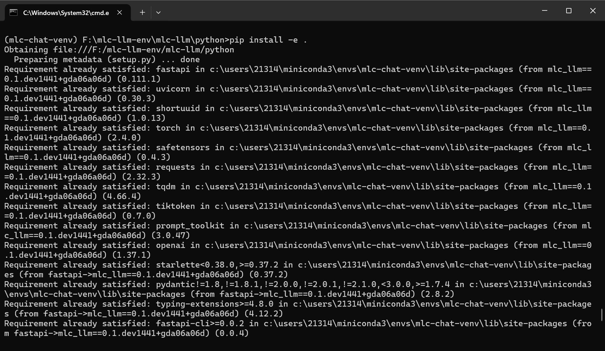
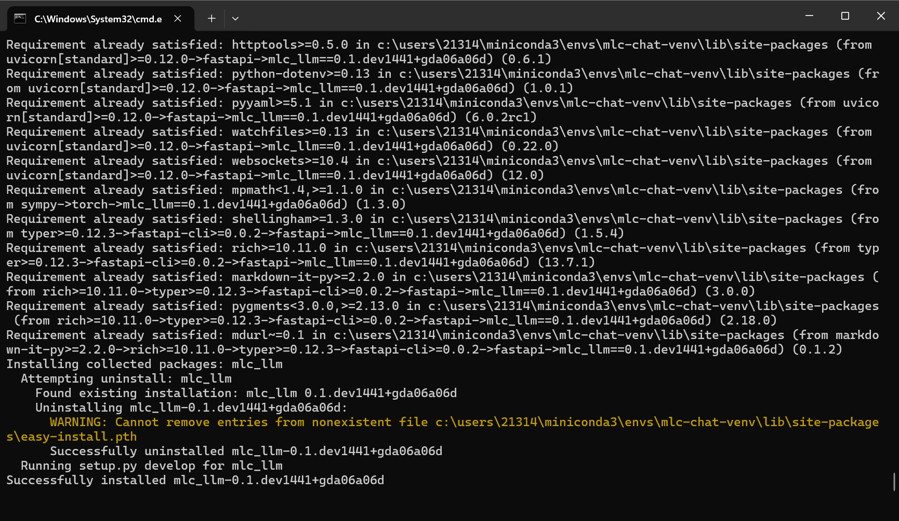
#### Step 4. Validate installation. 
You may validate if MLC libarires and mlc_llm CLI is compiled successfully using the following command:
```
# expected to see `libmlc_llm.so` and `libtvm_runtime.so`
ls -l ./build/
# expected to see help message
mlc_llm chat -h
```
<font color="#dd0000">但是我在运行mlc_llm chat -h的时候，出现了错误：OSError: [WinError 1114] 动态链接库(DLL)初始化例程失败。</font><br /> 
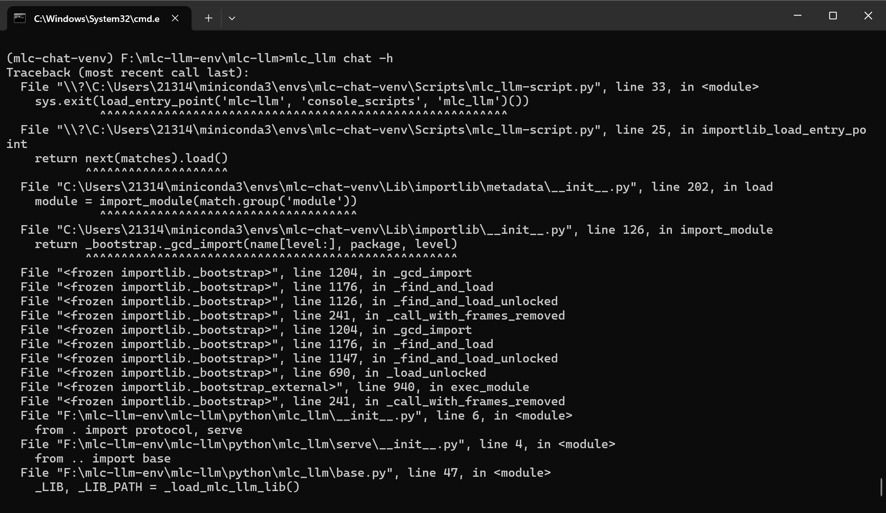
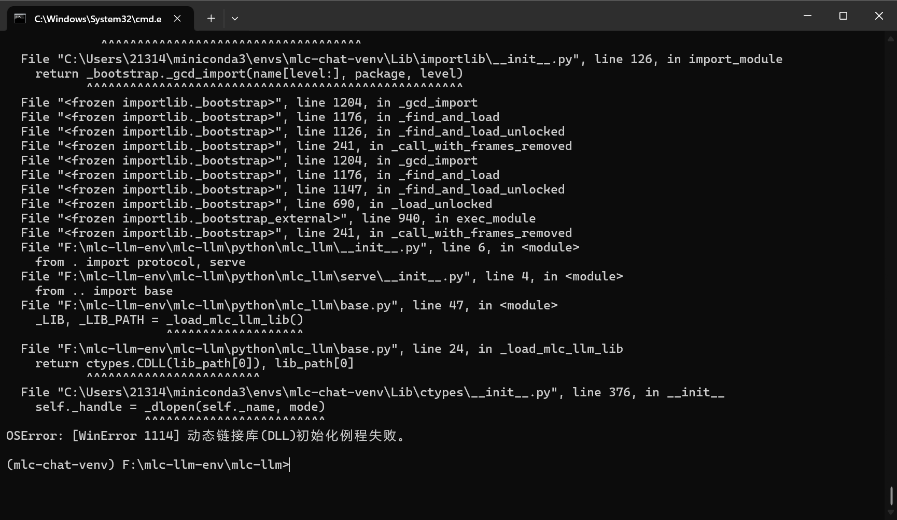

Finally, you can verify installation in command line. You should see the path you used to build from source with:
```
python -c "import mlc_llm; print(mlc_llm)"
```
---
## 一、Install MLC-LLM Package
### Option 1. Prebuilt Package
```cpu+vulkan
conda activate your-environment
python -m pip install --pre -U -f https://mlc.ai/wheels mlc-llm-nightly mlc-ai-nightly
```

>Please make sure your conda environment comes with python and pip. Make sure you also install the following packages, vulkan loader, clang, git and git-lfs to enable proper automatic download and jit compilation.
>>conda install -c conda-forge clang libvulkan-loader git-lfs git

### verify installation 
Then you can verify installation in command line:
```
python -c "import mlc_llm; print(mlc_llm)"
# Prints out: <module 'mlc_llm' from '/path-to-env/lib/python3.11/site-packages/mlc_llm/__init__.py'>
```
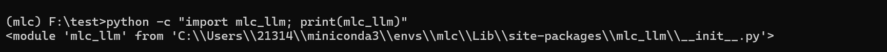
## 二、Compile Model Libraries
>To run a model with MLC LLM in any platform, we need:
>1. Model weights converted to MLC format 
>2. Model library that comprises the inference logic

前提：（安装TVM Unity 编译器）
### Install TVM Unity Compiler
#### Prebuilt Package
```
conda activate your-environment
python -m pip install --pre -U -f https://mlc.ai/wheels mlc-ai-nightly
```
>Make sure you also install vulkan loader and clang to avoid vulkan not found error or clang not found(needed for jit compile)
>>conda install -c conda-forge clang libvulkan-loader

验证：
```
python -c "import tvm; print(tvm.__file__)"
```
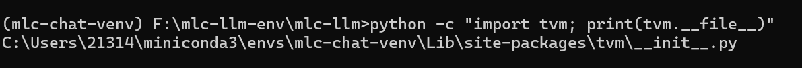

#### 1. Clone from HF and convert_weight
You can be under the mlc-llm repo, or your own working directory. Note that all platforms can share the same compiled/quantized weights.
```
# Create directory
mkdir -p dist/models && cd dist/models
# Clone HF weights
git lfs install
git clone https://huggingface.co/meta-llama/Meta-Llama-3.1-8B-Instruct
cd ../..
# Convert weight
mlc_llm convert_weight ./dist/models/Meta-Llama-3.1-8B-Instruct/ --quantization q4f16_1 -o dist/Meta-Llama-3.1-8B-Instruct-q4f16_1-MLC
```
>hf下载太慢，我采用了镜像站下载https://hf-mirror.com/meta-llama/Meta-Llama-3.1-8B-Instruct

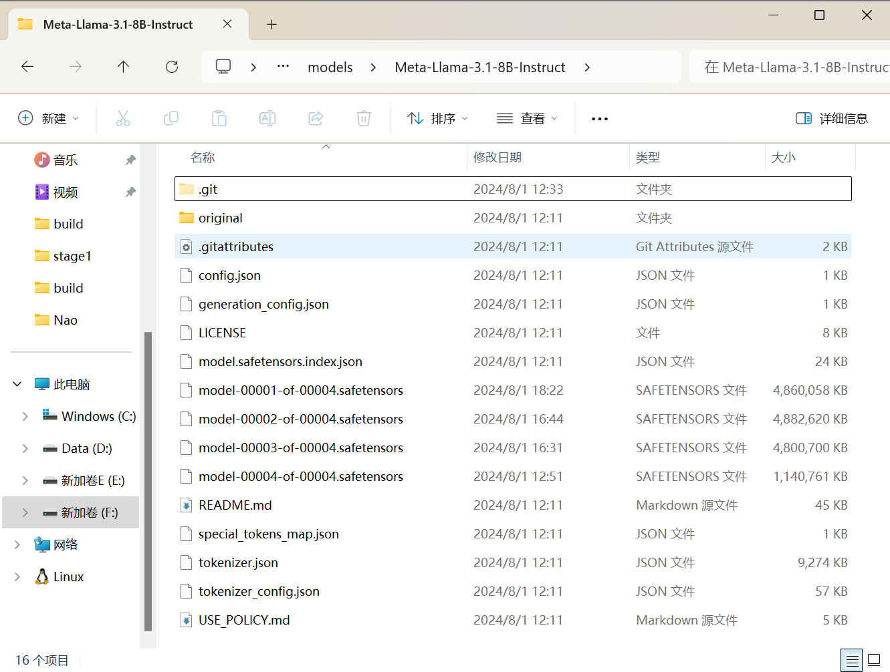
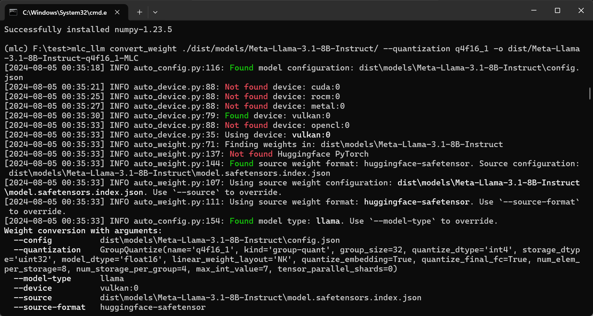
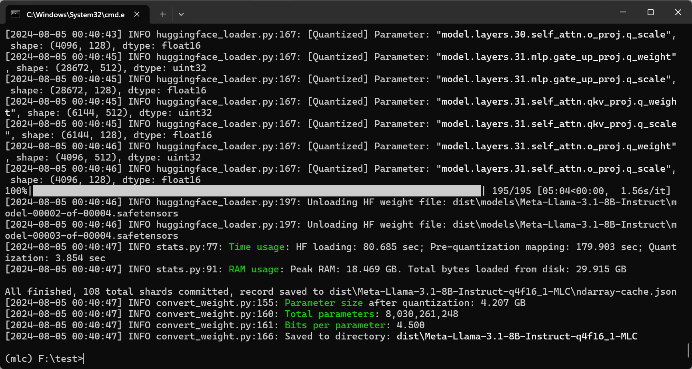
#### 2.Generate mlc-chat-config and compile
A model library is specified by:

-The model architecture (e.g. llama-2, gpt-neox)

-Quantization (e.g. q4f16_1, q0f32)

-Metadata (e.g. context_window_size, sliding_window_size, prefill-chunk-size), which affects memory planning

-Platform (e.g. cuda, webgpu, iOS)

All these knobs are specified in mlc-chat-config.json generated by gen_config.
```
# Create output directory for the model library compiled
mkdir dist/libs
```
Vulkan for windows:
```
# 1. gen_config: generate mlc-chat-config.json and process tokenizers
mlc_llm gen_config ./dist/models/Meta-Llama-3.1-8B-Instruct/ --quantization q4f16_1 --conv-template llama-3_1 -o dist/Meta-Llama-3.1-8B-Instruct-q4f16_1-MLC/
# 2. compile: compile model library with specification in mlc-chat-config.json
mlc_llm compile ./dist/Meta-Llama-3.1-8B-Instruct-q4f16_1-MLC/mlc-chat-config.json --device vulkan -o dist/libs/Meta-Llama-3.1-8B-Instruct-q4f16_1-vulkan.dll
```
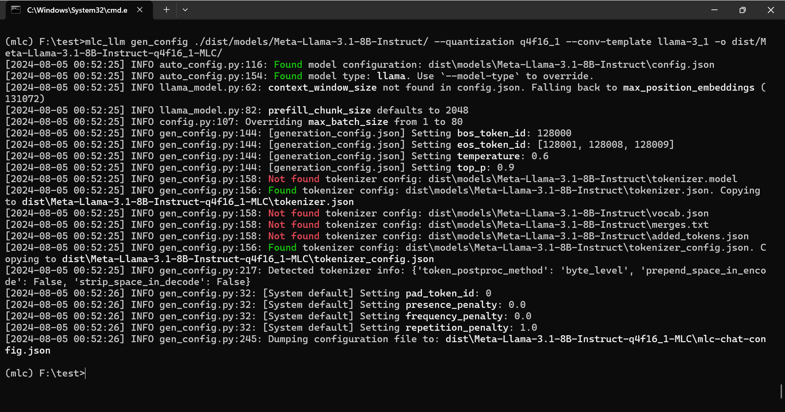
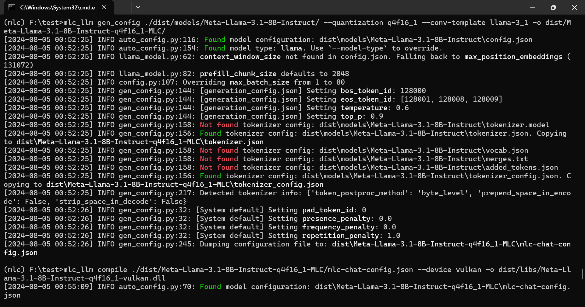
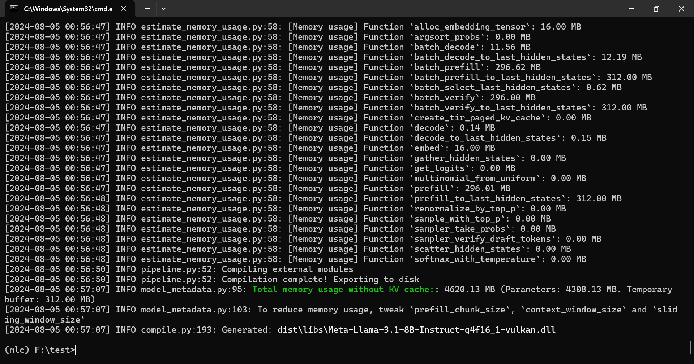
#### 3.Verify output and chat
By executing the compile command above, we generate the model weights, model lib, and a chat config. We can check the output with the commands below:
```python
from mlc_llm import MLCEngine

# 创建引擎实例
engine = MLCEngine(
    model="./dist/Meta-Llama-3.1-8B-Instruct-q4f16_1-MLC",
    model_lib="./dist/libs/Meta-Llama-3.1-8B-Instruct-q4f16_1-vulkan.dll"
)

# 创建聊天完成请求
response = engine.chat.completions.create(
    messages=[{"role": "user", "content": "hello"}]
)

# 打印响应
print(response)
```
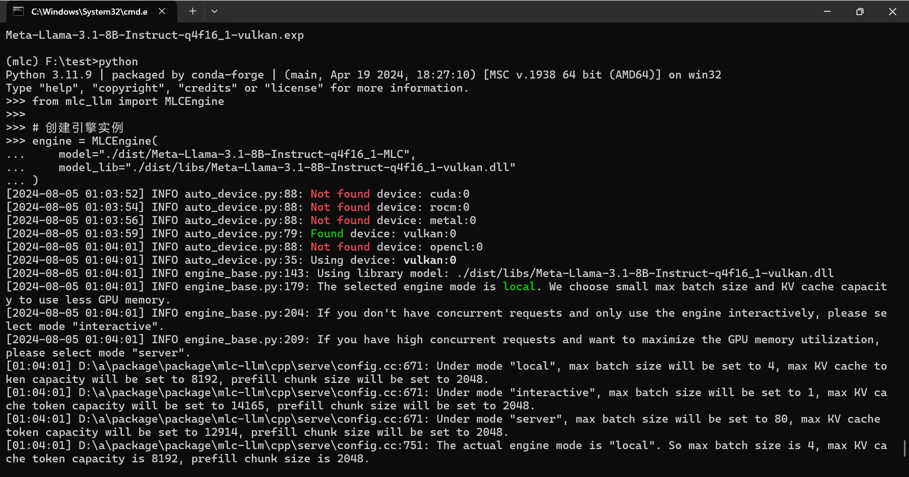

成功生成对话。具体响应内容为：
```
id='chatcmpl-31a1500b0d9a459fa9cdefdd26692d4e'
choices=[
    ChatCompletionResponseChoice(
        finish_reason='stop',
        index=0,
        message=ChatCompletionMessage(
            content="Hello! It's nice to meet you. Is there something I can help you with, or would you like to chat? I'm here to listen and assist in any way I can.",
            role='assistant',
            name=None,
            tool_calls=None,
            tool_call_id=None
        ),
        logprobs=None
    )
]
created=1722791070
model=None
system_fingerprint=''
object='chat.completion'
usage=CompletionUsage(
    prompt_tokens=26,
    completion_tokens=39,
    total_tokens=65,
    extra={
        'prompt_tokens': 26,
        'completion_tokens': 39,
        'prefill_tokens': 26,
        'decode_tokens': 38,
        'jump_forward_tokens': 0,
        'prefill_tokens_per_s': 6.3393810052834345,
        'decode_tokens_per_s': 4.4033245007278925,
        'end_to_end_latency_s': 12.731190000000002,
        'ttft_s': 4.1013468,
        'inter_token_latency_s': 0.32644076923076926
    }
)
```
你的模型成功生成了一个聊天响应。以下是对输出响应的详细解释：

### 响应结构

```plaintext
id='chatcmpl-31a1500b0d9a459fa9cdefdd26692d4e'
choices=[
    ChatCompletionResponseChoice(
        finish_reason='stop',
        index=0,
        message=ChatCompletionMessage(
            content="Hello! It's nice to meet you. Is there something I can help you with, or would you like to chat? I'm here to listen and assist in any way I can.",
            role='assistant',
            name=None,
            tool_calls=None,
            tool_call_id=None
        ),
        logprobs=None
    )
]
created=1722791070
model=None
system_fingerprint=''
object='chat.completion'
usage=CompletionUsage(
    prompt_tokens=26,
    completion_tokens=39,
    total_tokens=65,
    extra={
        'prompt_tokens': 26,
        'completion_tokens': 39,
        'prefill_tokens': 26,
        'decode_tokens': 38,
        'jump_forward_tokens': 0,
        'prefill_tokens_per_s': 6.3393810052834345,
        'decode_tokens_per_s': 4.4033245007278925,
        'end_to_end_latency_s': 12.731190000000002,
        'ttft_s': 4.1013468,
        'inter_token_latency_s': 0.32644076923076926
    }
)
```
##### 详细解释
1. **id**: `chatcmpl-31a1500b0d9a459fa9cdefdd26692d4e`
   - 唯一标识此聊天完成请求的 ID。

2. **choices**:
   - 包含一个或多个响应选项。在这个例子中，只有一个选项。

3. **ChatCompletionResponseChoice**:
   - **finish_reason**: 'stop'
     - 指示生成响应的原因。在这种情况下，响应正常完成。
   - **index**: 0
     - 选项的索引。对于多选项响应，这将指示该选项的位置。
   - **message**:
     - **content**: "Hello! It's nice to meet you. Is there something I can help you with, or would you like to chat? I'm here to listen and assist in any way I can."
       - 模型生成的响应内容。
     - **role**: 'assistant'
       - 角色是助手，表明这是模型生成的响应。

4. **created**: 1722791070
   - 响应生成的时间戳（Unix 时间戳格式）。

5. **model**: None
   - 模型信息，可能在某些实现中未填写。

6. **system_fingerprint**: ''
   - 系统指纹信息，可能在某些实现中未填写。

7. **object**: 'chat.completion'
   - 表示响应的对象类型。

8. **usage**:
   - **prompt_tokens**: 26
     - 提示文本中的标记数量。
   - **completion_tokens**: 39
     - 生成响应中的标记数量。
   - **total_tokens**: 65
     - 总标记数量（提示 + 响应）。
   - **extra**:
     - **prefill_tokens**: 26
       - 预填充标记数量。
     - **decode_tokens**: 38
       - 解码标记数量。
     - **jump_forward_tokens**: 0
       - 向前跳转标记数量。
     - **prefill_tokens_per_s**: 6.3393810052834345
       - 每秒预填充标记数。
     - **decode_tokens_per_s**: 4.4033245007278925
       - 每秒解码标记数。
     - **end_to_end_latency_s**: 12.731190000000002
       - 端到端延迟时间（秒）。
     - **ttft_s**: 4.1013468
       - 首字节延迟时间（秒）。
     - **inter_token_latency_s**: 0.32644076923076926
       - 每个标记间的延迟时间（秒）。

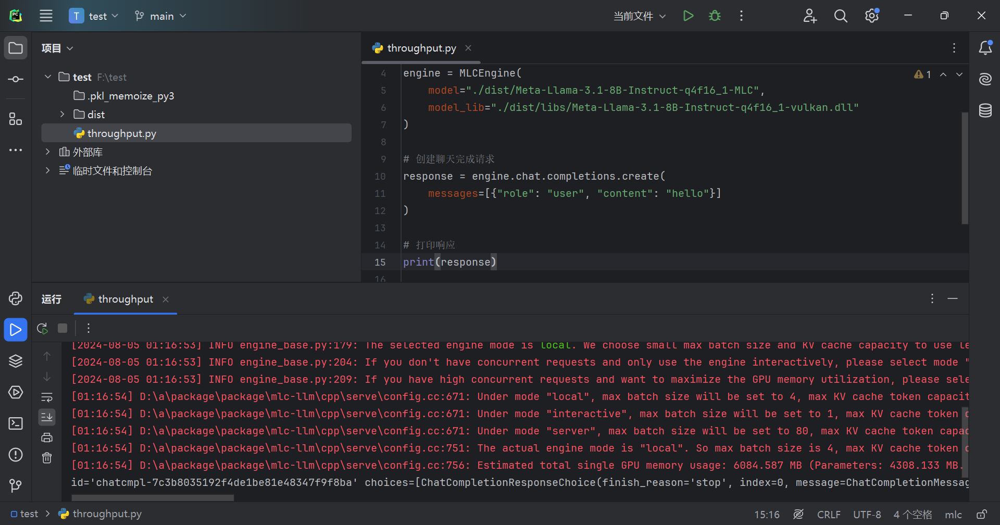
问答其实效果不是特别好，模型对中文理解不高，推理时间过长（也有我用cpu运行的原因）
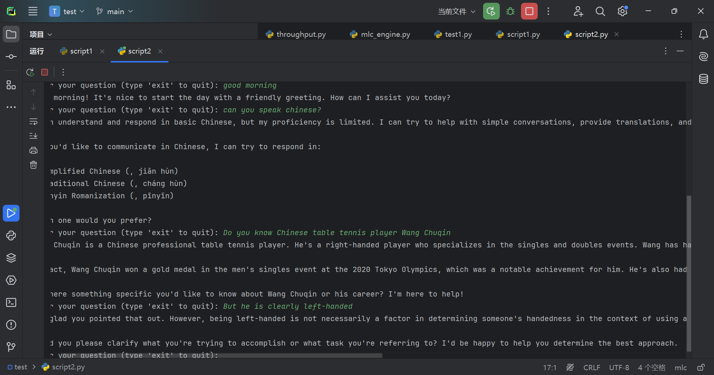

---
用wrk测试性能
1. 创建 Flask 应用
创建一个新的 Python 文件 app.py：
```python
from flask import Flask, request, jsonify
from mlc_engine import get_engine

app = Flask(__name__)
engine = get_engine()

@app.route('/chat', methods=['POST'])
def chat():
    data = request.json
    message = data.get('message')
    response = engine.chat.completions.create(
        messages=[{"role": "user", "content": message}]
    )
    return jsonify(response)

if __name__ == '__main__':
    app.run(host='0.0.0.0', port=5000)
```
2. 运行 Flask 应用
```
python app.py
```
1. 在GitHub下载和安装 wrk
在 WSL 中编译 wrk
安装依赖包：
```
sudo apt update
sudo apt install build-essential libssl-dev
sudo apt install unzip
```
编译 wrk：
```
make
```
2. 创建 Lua 脚本
创建一个包含 POST 请求负载的 Lua 脚本 post.lua：
```
wrk.method = "POST"
wrk.body   = '{"message":"hello"}'
wrk.headers["Content-Type"] = "application/json"
```
3. 运行 wrk 测试
```
./wrk -t12 -c400 -d30s http://192.168.2.249:5000/chat -s post.lua
```
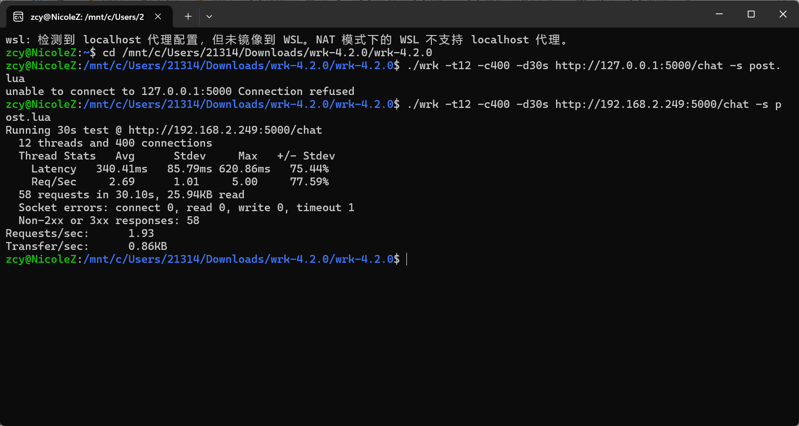

>zcy@NicoleZ:/mnt/c/Users/21314/Downloads/wrk-4.2.0/wrk-4.2.0$ ./wrk -t12 -c400 -d30s http://192.168.2.249:5000/chat -s post.lua
Running 30s test @ http://192.168.2.249:5000/chat
  12 threads and 400 connections
  Thread Stats   Avg      Stdev     Max   +/- Stdev
    Latency   340.41ms   85.79ms 620.86ms   75.44%
    Req/Sec     2.69      1.01     5.00     77.59%
  58 requests in 30.10s, 25.94KB read
  Socket errors: connect 0, read 0, write 0, timeout 1
  Non-2xx or 3xx responses: 58
Requests/sec:      1.93
Transfer/sec:      0.86KB

从 `wrk` 的输出结果可以看出，Flask 服务器在 30 秒的测试期间处理了 58 个请求，每秒约 1.93 个请求。

#### 输出结果解释

- **Latency (延迟)**: 请求的平均响应时间为 340.41 毫秒，标准差为 85.79 毫秒，最大延迟为 620.86 毫秒。
- **Req/Sec (每秒请求数)**: 每秒处理的请求数平均为 2.69，标准差为 1.01，最大为 5.00。
- **Total Requests (总请求数)**: 在 30.10 秒内，总共处理了 58 个请求。
- **Data Transferred (传输的数据)**: 总共传输了 25.94 KB 的数据。
- **Socket Errors (套接字错误)**: 在测试期间，没有发生连接、读取或写入错误，但发生了 1 次超时。
- **Non-2xx or 3xx responses**: 所有的 58 个响应都不是 2xx 或 3xx 状态码，表明这些请求失败或返回了错误状态码。
- **Requests/sec (每秒请求数)**: 平均每秒处理 1.93 个请求。
- **Transfer/sec (每秒传输量)**: 平均每秒传输 0.86 KB 的数据。