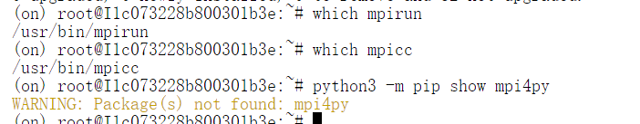
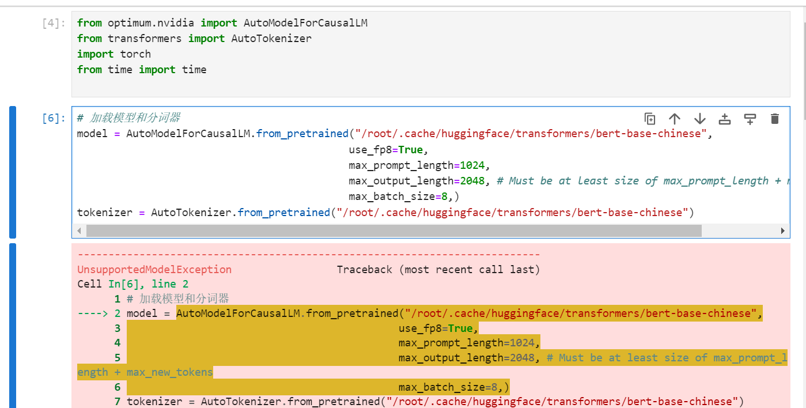
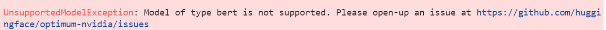
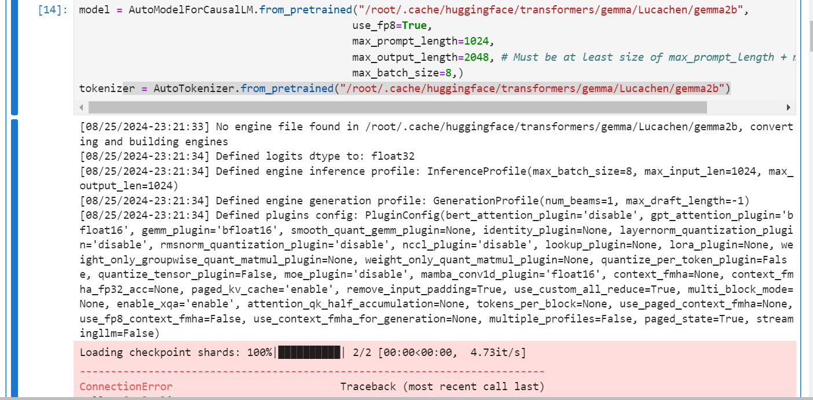
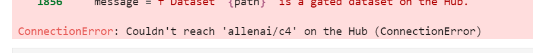

## 一、使用Optimum-NVIDIA优化
>Optimum 作为 Transformer 的扩展，通过利用用户目标硬件的最大效率来加速模型训练和推理。Optimum 集成了机器学习加速器如 ONNX Runtime，和专业的硬件如英特尔的 Habana Gaudi，可以提高用户训练和推理的速度。

**技术分析：**
Optimum-NVIDIA的核心在于它的优化器和数据加载器，它们针对NVIDIA的硬件进行了专门优化：

- Optimizers: 这些优化器能够有效地利用CUDA（Compute Unified Device Architecture）库，为PyTorch和TensorFlow等深度学习框架提供加速。例如，它包含了针对Transformer模型的Quantization、Bitserial和AMP (Automatic Mixed Precision) 等优化策略。

- Data Loaders: 数据预处理是性能瓶颈之一，Optimum-NVIDIA提供了高效的多线程数据加载器，可以并行加载和预处理大规模数据集，显著减少等待时间。

- Inference Acceleration: 库还提供了特定于GPU的推理加速功能，如NVIDIA Tensor Cores 和 Volta Tensor Core 加速，这在模型部署时特别有用。

- Integrations: 与Hugging Face的Transformers库无缝集成，使得开发者无需更改现有代码就能享受到性能提升。


在使用 `Optimum-NVIDIA` 优化推理引擎之前，请确保满足以下条件：
1. **创建虚拟环境**：使用 `conda create` 命令来创建名为 `on` 的虚拟环境，并指定 Python 版本为 3.10.12：
   ```bash
   conda create -n on python=3.10.12
   ```

2. **激活虚拟环境**：
   ```bash
   conda activate on
   ```

3. **安装 CUDA 依赖**：确保系统已经安装 CUDA 12.4，并配置好相关环境：
   ```bash
   conda install cudatoolkit=12.4
   ```

4. **使用 `pip` 安装 Optimum-NVIDIA**：
    ```bash
    apt-get update && apt-get -y install python3.10 python3-pip openmpi-bin libopenmpi-dev
    python -m pip install --pre --extra-index-url https://pypi.nvidia.com optimum-nvidia
    ```

    *问题：在安装 OpenMPI 时，尽管 mpirun 和 mpicc 存在于 /usr/bin/ 目录中，Python 环境中仍然无法找到 mpi4py。
    
    原因：OpenMPI 的库未正确链接到当前 Python 环境，导致 mpi4py 无法被正确识别和使用。
    解决方案：使用 conda 重新安装 mpi4py*

5. **在虚拟环境中安装Jupyter和 `ipykernel` 并注册环境为内核**：
   ```bash
   pip install ipykernel
   python -m ipykernel install --user --name on --display-name "Python (on)"
   ```

6. **加载Transformer模型并测试吞吐量**:

    *Optimum-NVIDIA 中的 AutoModelForCausalLM只支持因果语言模型，不支持bert类型的模型。下载模型gemma。
    
    *
    ```python
    from optimum.nvidia import AutoModelForCausalLM
    from transformers import AutoTokenizer
    import torch
    from time import time
    
    model = AutoModelForCausalLM.from_pretrained("/root/.cache/huggingface/transformers/gemma/Lucachen/gemma2b",
    use_fp8=True,
    max_prompt_length=1024,
    max_output_length=2048, # Must be at least size of max_prompt_length + max_new_tokens
    max_batch_size=8,)
    tokenizer = AutoTokenizer.from_pretrained("/root/.cache/huggingface/transformers/gemma/Lucachen/gemma2b")
    ```
    模型引擎文件缺失且云服务器不能连接huggingface，出现连接失败。（主要原因是我之前又下载东西的时候给许多库更改的版本，导致现在版本有些混乱所以加载不到我已经下载的模型。。。）
    
    