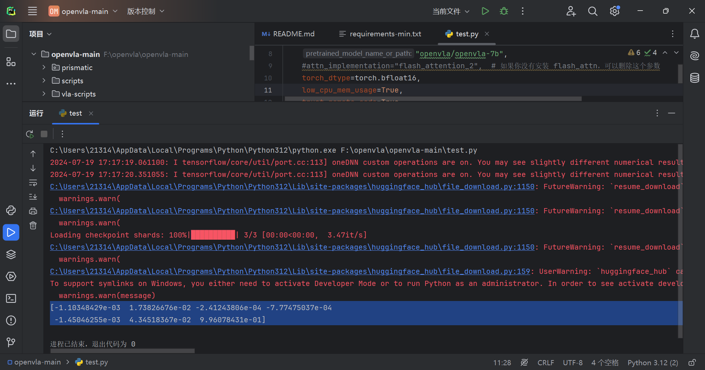
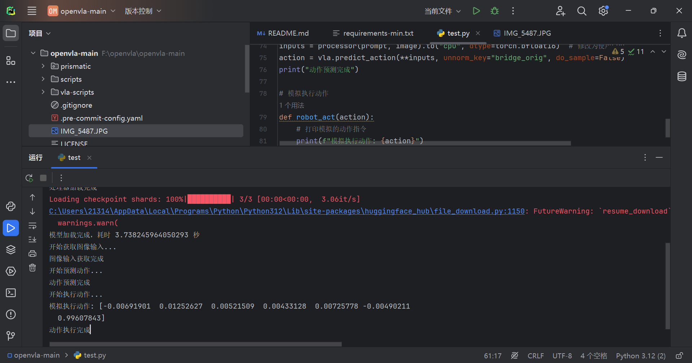

由于我电脑上没有gpu,所以改用的cpu进行测试。
```python
from transformers import AutoModelForVision2Seq, AutoProcessor
from PIL import Image
import torch

# 加载处理器和VLA模型
processor = AutoProcessor.from_pretrained("openvla/openvla-7b", trust_remote_code=True)
vla = AutoModelForVision2Seq.from_pretrained(
    "openvla/openvla-7b",
    #attn_implementation="flash_attention_2",  # 没有安装 flash_attn，删除这个参数
    torch_dtype=torch.bfloat16,
    low_cpu_mem_usage=True,
    trust_remote_code=True
).to("cpu")  # 修改为使用CPU

# 获取图像输入并格式化提示
def get_from_camera():
    # 示例：从本地加载图像
    return Image.open('IMG_5487.JPG')

image: Image.Image = get_from_camera()
prompt = "In: What action should the robot take to {<INSTRUCTION>}?\nOut:"

# 预测动作
inputs = processor(prompt, image).to("cpu", dtype=torch.bfloat16)  # 修改为使用CPU
action = vla.predict_action(**inputs, unnorm_key="bridge_orig", do_sample=False)

# 执行动作
def robot_act(action):
    # 示例：打印动作
    print(action)

robot_act(action)
```
预测结果：
[-1.10348429e-03  1.73826676e-02 -2.41243806e-04 -7.77475037e-04 -1.45046255e-03  4.34518367e-02  9.96078431e-01]


```python
from transformers import AutoModelForVision2Seq, AutoProcessor
from PIL import Image
import torch
import os
import time

# 设置环境变量以避免符号链接警告
os.environ["HF_HUB_DISABLE_SYMLINKS_WARNING"] = "1"

print("开始加载处理器和模型...")

# 加载处理器和VLA模型
processor = AutoProcessor.from_pretrained("openvla/openvla-7b", trust_remote_code=True)
print("处理器加载完成")

start_time = time.time()
vla = AutoModelForVision2Seq.from_pretrained(
    "openvla/openvla-7b",
    torch_dtype=torch.bfloat16,
    low_cpu_mem_usage=True,  # 确保已安装 accelerate 库
    trust_remote_code=True
).to("cpu")  # 修改为使用CPU
end_time = time.time()
print(f"模型加载完成，耗时 {end_time - start_time} 秒")

# 获取图像输入并格式化提示
def get_from_camera():
    # 示例：从本地加载图像
    return Image.open('IMG_5487.JPG')

print("开始获取图像输入...")
image: Image.Image = get_from_camera()

# 设置NAO机器人指令
instruction = "kick the football"
prompt = f"In: What action should NAO take to {instruction}?\nOut:"
print("图像输入获取完成")

# 预测动作
print("开始预测动作...")
inputs = processor(prompt, image).to("cpu", dtype=torch.bfloat16)  # 修改为使用CPU
action = vla.predict_action(**inputs, unnorm_key="bridge_orig", do_sample=False)
print("动作预测完成")

# 模拟执行动作
def robot_act(action):
    # 打印模拟的动作指令
    print(f"模拟执行动作: {action}")

print("开始执行动作...")
robot_act(action)
print("动作执行完成")

```
模拟执行动作: [-0.00691901  0.01252627  0.00521509  0.00433128  0.00725778 -0.00490211  0.99607843]
