# 基于城市道路的自动驾驶行人车辆检测与计数指导文档

## 一.项目说明

### 1.项目背景

随着自动驾驶技术的快速发展，对于精准、可靠的道路目标检测技术需求日益增长。在自动驾驶系统中，道路目标的精确识别和定位对于提高驾驶安全性、增强车辆自主决策能力以及优化交通流量具有至关重要的作用。作为智能交通系统的核心组成部分，计算机视觉技术通过自动获取和处理道路环境图像，为车辆提供了一种有效的感知和识别周边环境的方法。这不仅极大提高了识别效率和自动化程度，而且确保了检测的实时性和高准确性。

在此背景下，本次大赛旨在通过激发创新思维和促进先进计算机视觉与人工智能技术的研究与应用，推动自动驾驶技术和智能交通系统的发展。此次大赛将基于BDD100K数据集，这是一个全面、多样化的驾驶行为数据集，它提供了从不同地理位置、不同天气条件和不同时间段收集的大量实际驾驶视频和图像，以及详尽的标注信息，为参赛者提供了丰富的资源来开发和测试他们的道路目标检测算法。

通过参与本次挑战赛，参赛者将有机会将理论知识应用到实际问题中，不仅能提高参赛者在数据分析、算法设计和模型训练等方面的技能，还能促进团队合作和解决问题的能力。此外，大赛也旨在通过竞赛激发学生的创新精神，探索在复杂道路环境中进行高效准确目标检测的新方法，为自动驾驶技术的未来发展贡献新的思路和解决方案。本次比赛本次比赛对参赛者的吸引点在于，参赛者可以在实战场景中锻炼和提高自己的技术水平，借助 比赛平台，通过算法优化和迭代，提高算法识别效率和精度，经过训练后的算法经过优化，然后在智能 边缘计算终端得到验证，从设计到实现及应用，步步为营，层层提升。这不仅可以推进人工智能技术在 各个行业的应用，还可为参赛者提供更广阔的职业发展空间。

 

### 2.项目难点

1. 复杂多变的城市道路环境

城市道路环境复杂多变，包括不同的交通参与者（如行人、自行车、各类车辆）、复杂的交通标志和信号灯系统、以及建筑物和自然环境等多种元素。在这种环境下，准确识别和定位目标，尤其是在交通密集、场景复杂的情况下，对算法的识别能力和鲁棒性提出了极高的要求。 

2. 光照条件和天气变化的影响

光照条件和天气变化对图像质量有显著影响，比如夜间、逆光、阴雨、雾天等条件下，目标检测的难度显著增加。设计能够适应各种光照和天气条件的鲁棒算法是一个重大挑战。

3. 大规模数据的处理

BDD数据集规模庞大，包含大量的图像和视频数据，其中包括丰富的场景、目标和注释信息。高效地处理和利用这些大规模数据，对算法的数据处理能力和学习效率提出了考验。 

4. 目标遮挡和相互作用

在城市道路上，目标之间经常会发生遮挡和相互作用，比如行人可能被停在路边的车辆遮挡，或者多辆车在交叉路口密集交汇。这些情况增加了目标检测的复杂度，要求算法能够有效处理遮挡和识别交互中的目标。 

5. 多目标检测与分类的准确性

城市道路环境中存在多种类型的目标，不仅要求算法能够准确检测出所有目标，还要求对这些目标进行准确分类。这需要算法能够捕捉到细微的特征差异，以区分不同类型的目标。

## 二.数据准备

### 数据集介绍

本次比赛选用的是BDD100k数据集，是有累计1100小时驾驶体验的10万个高清视频序列组成。每个视频长度约40s，分辨率为1280*720、帧率为30fps，该数据集涵盖不同的天气条件如晴天、阴天和雨天以及白天晚上的不同时间段的驾驶信息。研究者在每个视频的第10s作为采样关键帧，并为这些关键帧提供注释，以下是标注的类别：


| category_id | objects       | 目标     |
| ----------- | ------------- | -------- |
| 0           | bus           | 公交车   |
| 1           | traffic light | 交通灯   |
| 2           | traffic sign  | 交通标志 |
| 3           | person        | 人       |
| 4           | bike          | 自行车   |
| 5           | truck         | 卡车     |
| 6           | motor         | 摩托车   |
| 7           | car           | 汽车     |
| 8           | rider         | 乘车人   |

trianA数据集下载链接：https://pan.baidu.com/s/1zj3MqZEHKHpFACs95Ov4gQ?pwd=ma1p 

trianB数据集下载链接：https://pan.baidu.com/s/1whg_-jLfbUnfpZkKjvdziQ?pwd=yg54 

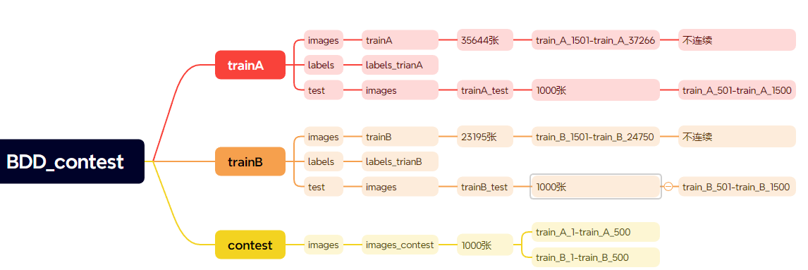

trainA压缩包有2.37G，trainB压缩包880M,下载有点慢，同学们也可以从pdd中买一天的百度网盘会员进行加速。

#### 1.创建项目名

下载好后，我们在自己的工作区创建一个项目，这里我取得名字为：BDD_contest，当然也可以在pycharm中创建；后面可以将下载好的模型放到BDD_contest的目录下；如下图所示：

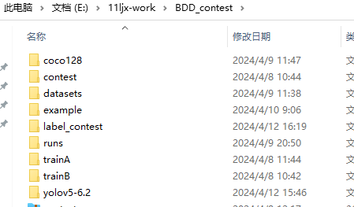

#### 2.下载数据集

下载后解压后文件夹：

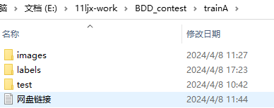

数据格式如下：

```python
├── images
│   ├── train-35644张图片
│   
            
├── labes
│   ├── train-35644个txt标签
│
├── test-1000张图片
```

查看imges:

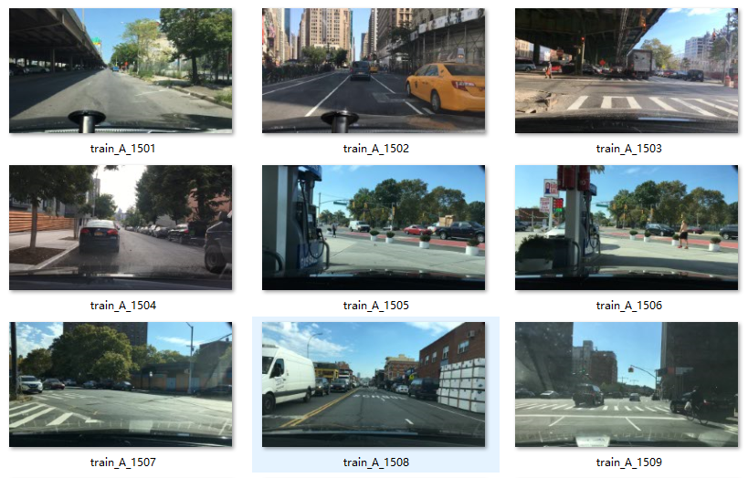

查看第一张图片对应的labels:

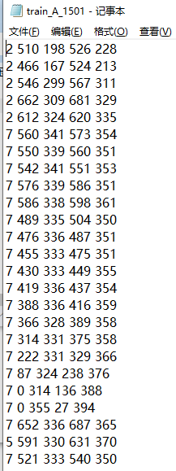


## 三.模型选择

针对基于城市道路的行人和车辆检测及计数，可以采用多种计算机视觉模型，这些模型主要是基于深度学习的目标检测和目标跟踪算法。以下是一些适用于此任务的主流针对基于城市道路的行人和车辆检测及计数，尤其是使用BDD100K数据集，可以采用多种计算机视觉模型，这些模型主要是基于深度学习的目标检测和目标跟踪算法。以下是一些适用于此任务的主流模型：

### 1. 目标检测模型

目标检测模型能够在图像中同时识别出目标的类别和位置。对于行人和车辆计数，以下模型是非常流行的选择：

**YOLO系列 (You Only Look Once)**

- **YOLOv5--YOLOv10: 这些模型因其快速和准确性而受到欢迎，非常适合实时计数应用。
- **优点**: 高速检测，单一网络预测边界框和类别，适合实时应用。
- **缺点**: 在较小的目标检测上可能不如其他模型准确。

### 2. 目标跟踪算法

对于视频数据，可以结合目标跟踪算法来实现更精准的车辆和行人计数，例如：

- **SORT (Simple Online and Realtime Tracking)**
- **Deep SORT (Deep Learning based Simple Online and Realtime Tracking)**

这些跟踪算法可以帮助在连续的视频帧中跟踪检测到的行人和车辆，从而提高整体计数的准确性和稳定性。

本次赛题的基准线是基于yolov5实现车辆行人计数的，同学们可以尝试其他多种模型，比如：结合目标检测与跟踪技术：yolov8+deepsort以提高可以在保证速度的同时，最大化准确度，尤其适用于动态和多目标的城市道路场景。

下面以Train A数据集为例，使用Yolov5实现车辆行人计数的详细步骤：

## 四.模型准备

### 1.下载yolov5代码

#### (1)官网下载

从github上下载yolov5的模型，这里选取的yolov5 ，tags为6.2的版本。

下载网址：https://github.com/ultralytics/yolov5

点击code---download 即可下载压缩包

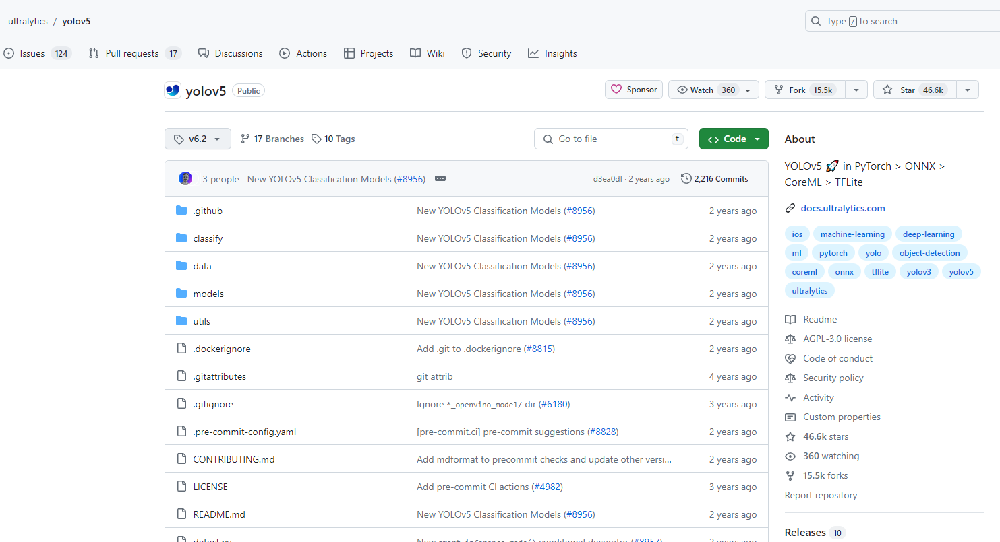

#### (2)百度网盘下载

链接：https://pan.baidu.com/s/1kJsy3pDMizmGqFo8bQb1cw 提取码：0wog 

### 2.下载预训练模型

从刚刚下载yolov5的github的官网上，下载的预训练模型,

yolov5一共有5种模型：

- YOLOv5n:最小的模型，适合在移动端部署。

- YOLOv5s：小型模型，适合在CPU上进行推断。

- YOLOv5m：中等大小的模型，是速度和准确性之间的平衡点，适用于许多数据集和训练任务。

- YOLOv5l：大型模型，适用于需要检测较小物体的数据集。

- YOLOv5x：最大的模型，拥有最高的mAP指标，但相对较慢，参数数量为86.7百万。

  这里我们选取了比较小的YOLOv5s的模型，可以在CPU上训练，亦可以从GPU上训练。

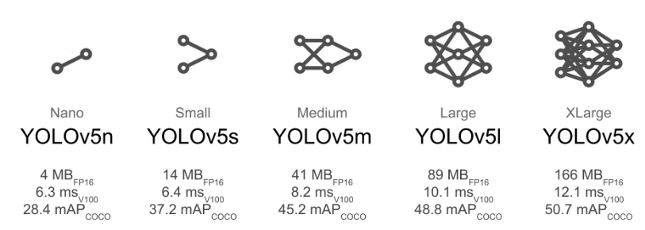


### 3.配置环境

#### （1）python和pytorch环境配置

首先为自己的项目创建虚拟环境，这里我的项目名为：pytorch_study, python 版本为3.9；请在conda命令行中执行下列操作：

```bash
conda create -n pytorch_study python==3.9
conda activate pytorch_study
```

#### （2）pytorch安装

（gpu版本和cpu版本的安装）
实际测试情况是YOLOv5在CPU和GPU的情况下均可使用，不过在CPU的条件下训练那个速度会令人发指，所以有条件的小伙伴一定要安装GPU版本的Pytorch。

##### pytorch安装注意事项

①安装之前一定要先更新你的显卡驱动，去官网下载对应型号的驱动安装
②30系显卡只能使用cuda11的版本
③一定要创建虚拟环境，这样的话各个深度学习框架之间不发生冲突

这里我下载的cuda版本为11.1；其对应的torch安装命令如下：

```
pip3 install torch==1.8.2 torchvision==0.9.2 torchaudio==0.8.2 --extra-index-url https://download.pytorch.org/whl/lts/1.8/cu111 -i https://mirrors.aliyun.com/pypi/simple
```

比如我这里使用的是：cuda11.1，torch下载的版本是1.8.2

#### （3）下载requirements文件

##### ①conda安装的方式

如下：

```
conda activate pytorch_study
```

然后执行以下命令：

```python
pip install -r .\requirements.txt  -i https://pypi.tuna.tsinghua.edu.cn/simple
```

##### ②win +r+cmd 安装

```
D:\11ljx-work\BDD_contest>
```

同样然后执行以下命令：

```
pip install -r .\requirements.txt  -i https://pypi.tuna.tsinghua.edu.cn/simple
```

开始安装，最后以successfuly结尾；

#### （4）pycharm中设置python环境 

从pycharm中打开BDD_contest; 开始初始化设置

File -> Settings -> Python Interpreter -> add Interpreter -> virtualenv Enviroment -> existing-> 选择你的虚拟环境路径 ->apply-> ok

python interpreter 中add interpreter

按照下图所示操作，最后apply  ok ;

python interpreter 中add interpreter

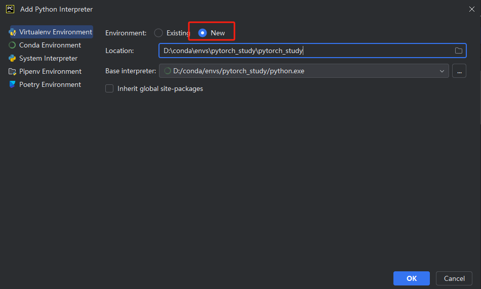

按照下图所示操作，最后apply ok ;

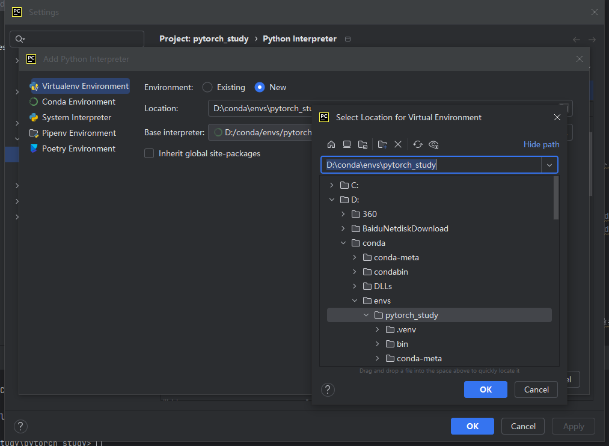

## 五.数据预处理

### 1.标签转换

（1）我们以trianA_1670的图片和标签为例，首先打开标签文件如下，

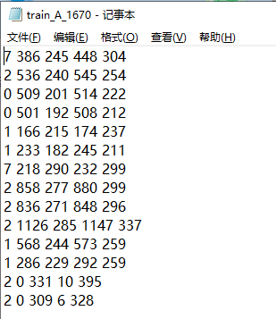

分别代表：类别标签,   x_min ,   y_min ,  x_max ,  y_max;

 x_min ,   y_min为左上角的坐标， x_max ,  y_max为右下角的坐标；

（2）在画图工具中打开train_A_1670的图片如下：


而yolov5的图像和标签如下：

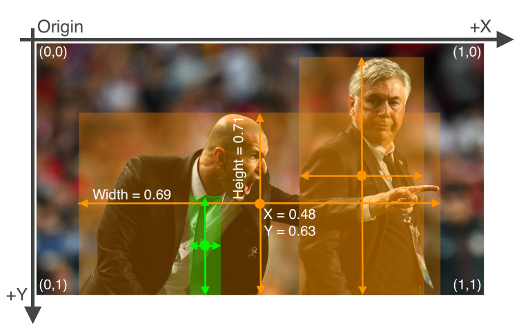


使用注释工具标注图像后，将标签导出到 **YOLO 格式**有一个 `*.txt` 文件（如果图像中没有对象，则无 `*.txt` 文件）。

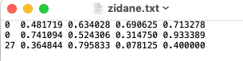

`*.txt` 文件规格为

- 每个对象一行
- 每一行是 `class x_center y_center width height` 格式。
- 方框坐标必须在 **归一化 xywh** 格式（从 0 到 1）。如果您的方框以像素为单位，则除以 `x_center` 和 `width` 图像宽度，以及 `y_center` 和 `height` 按图像高度计算。x_center = ((x_min + x_max) / 2) / img_w          y_center = ((y_min + y_max) / 2) / img_h         width = (x_max - x_min) / img_w           height = (y_max - y_min) / img_h
- 类号以 0 为索引（从 0 开始）。
- 上图对应的标签文件包含2个人(0类)和一条领带(27类)

#### 创建labels_convert.py文件

下面我们将首先我们将标签文件处理成yolo的标签文件，创建脚本：labels_convert.py文件，

示例代码如下：

```python
import os

# 假设所有图片的大小是固定的，根据你的实际情况调整
img_width = 1280
img_height = 720

def convert_bbox_to_yolo_format(x_min, y_min, x_max, y_max, img_w, img_h):
    """
    将边界框从 <x_min, y_min, x_max, y_max> 转换为 YOLO 格式 <x_center, y_center, width, height>，
    并归一化坐标。
    """
    x_center = ((x_min + x_max) / 2) / img_w
    y_center = ((y_min + y_max) / 2) / img_h
    width = (x_max - x_min) / img_w
    height = (y_max - y_min) / img_h
    return x_center, y_center, width, height

def process_label_files(label_dir):
    for label_file in os.listdir(label_dir):
        file_path = os.path.join(label_dir, label_file)
        with open(file_path, 'r') as file:
            lines = file.readlines()

        # 准备新的标签内容
        new_lines = []
        for line in lines:
            parts = line.strip().split()
            if len(parts) == 5:
                cls, x_min, y_min, x_max, y_max = map(float, parts)
                x_center, y_center, width, height = convert_bbox_to_yolo_format(
                    x_min, y_min, x_max, y_max, img_width, img_height)
                new_line = f"{int(cls)}\t{x_center:.6f}\t{y_center:.6f}\t{width:.6f}\t{height:.6f}\n"
                new_lines.append(new_line)

        # 将转换后的标签写回文件
        with open(file_path, 'w') as file:
            file.writelines(new_lines)

if __name__ == "__main__":
    label_directory = 'trainA/labels/label-trainA'  # 修正路径中的反斜杠
    process_label_files(label_directory)

print("convert over")
```


### 2.数据集划分

我们的数据集结构为：

```
├── images
├── labels
```

而yolov5的数据集结构为：

```
├── images
│   ├── train
│   ├── val
│   └── test
├── labels
│   ├── train
│   ├── val
│   └── test
```

因此我们需要按照yolov5的数据集结构进行划分数据集。

#### 创建split_data.py

这里我们需要根据yolov5的数据结构，创建自己数据集的结构：这里来存放数据集信息，创建split_data.py；将图片和标签都按照训练集：校验集：测试集=8:1:1的比例进行划分；（训练集训练参数，校验集调整超参数，测试集对模型进行测试）

划分数据集的代码：

```python
import os
import random
from shutil import copyfile

def split_dataset(image_folder, txt_folder, output_folder, split_ratio=(0.8, 0.1, 0.1)):
    # Ensure output folders exist
    for phase in ['train', 'val', 'test']:
        os.makedirs(os.path.join(output_folder, 'images', phase), exist_ok=True)
        os.makedirs(os.path.join(output_folder, 'labels', phase), exist_ok=True)

    # Get list of image files
    image_files = [f for f in os.listdir(image_folder) if f.endswith(('.jpg', '.jpeg', '.png'))]
    random.shuffle(image_files)

    num_images = len(image_files)
    num_train = int(split_ratio[0] * num_images)
    num_val = int(split_ratio[1] * num_images)

    train_images = image_files[:num_train]
    val_images = image_files[num_train:num_train + num_val]
    test_images = image_files[num_train + num_val:]

    # Copy images and labels to respective folders
    for phase, images_list in zip(['train', 'val', 'test'], [train_images, val_images, test_images]):
        for image_file in images_list:
            # Copy image
            image_path = os.path.join(image_folder, image_file)
            target_image_path = os.path.join(output_folder, 'images', phase, image_file)
            copyfile(image_path, target_image_path)
            
            # Copy corresponding txt file if exists
            txt_file = os.path.splitext(image_file)[0] + '.txt'
            txt_path = os.path.join(txt_folder, txt_file)
            target_txt_path = os.path.join(output_folder, 'labels', phase, txt_file)
            if os.path.exists(txt_path):
                copyfile(txt_path, target_txt_path)

if __name__ == "__main__":
    image_folder_path = "trainA/images"
    txt_folder_path = "trainA/labels"
    output_dataset_path = "datasets"

    split_dataset(image_folder_path, txt_folder_path, output_dataset_path)

print("Split complete.")
```

划分训练集后得到images如下：

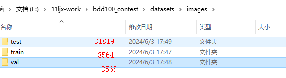

得到的labels如下：

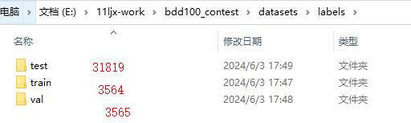

## 六.模型训练

### 1.创建bdd_traina.yaml文件

YOLOv5训练中最重要的一个属性是数据集的YAML文件。

在yolov5目录下的data文件夹下新建一个bdd_traina.yaml文件（可以自定义命名）。在执行训练脚本时，我们需要将此文件路径作为参数提供，以便脚本可以识别图像路径、标签路径和类别名称。数据集已经包含了这个文件，以下是我们在这里用于训练的bdd_traina.yaml文件的内容：

```python
path: E:\11ljx-work\BDD_contest\datasets  # dataset root dir
train: images/train # train images (relative to 'path') 128 images
val: images/val  # val images (relative to 'path') 128 images
test:  # test images (optional)

# Classes
nc: 9  # number of classes
names: ['bus','traffic light', 'traffic sign', 'person', 'bike', 'truck', 'motor', 'car', 'rider', 
        ]  # class names
```

### 2.修改train.py

在正式开始训练之前，需要对train.py进行以下修改：

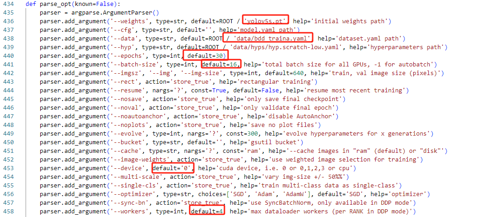


以上参数解释如下：

epochs：指的就是训练过程中整个数据集将被迭代多少次,显卡不行,就调小点。默认是300，老师这里的示例写的是30

batch-size：一次看完多少张图片才进行权重更新，梯度下降的mini-batch,显卡不行,就调小点，主要是因为在神经网络训练过程中，Batch size决定了每次训练迭代时，一次性加载到GPU显存中的数据量。也就是说，Batch size实际上直接影响到了GPU内存的使用情况, 这里我们可以使用yolov5默认的16；

cfg：存储模型结构的配置文件

data：存储训练、测试数据的文件

img-size：输入图片宽高,显卡不行,就调小点。

device:  如果有一张显卡的话，default改为0；没有显卡的default='cpu'

workes: 进程数，默认值为8,如果显存不足的话就设置小一点，实在不行设为0.

在YOLO中，对图片进行resize是指将图像的尺寸改变为模型所需的输入尺寸，比如yolo默认的图片大小为640x640。而原图中的像素是指图像中的每一个点，包含了颜色和亮度等信息。当图片被resize时，会根据新的尺寸重新采样和插值，所以resize后的图像像素和原图中的像素是有区别的。

举个例子，如果原图的尺寸是4000x3800，那么resize到640x640后，图像中的每个像素点都会发生变化，原来在4000x3800图像中相邻的像素点，在640x640的图像中可能就不再相邻，原图中的某个像素点在新图中可能就不存在了，取而代之的是插值生成的新的像素点。

因此，resize操作会改变图像的分辨率，可能会对图像的细节信息造成一定的损失，但是对于目标检测任务，主要是通过学习图像中目标的形状、纹理等特征进行识别，所以适度的resize不会对检测结果产生太大影响。同时，resize可以降低计算复杂度，加快模型的运行速度。

全部参数解析：    

```python
def parse_opt(known=False):
    parser = argparse.ArgumentParser()
    
    # 预训练模型权重文件路径
    parser.add_argument('--weights', type=str, default=ROOT / 'yolov5s.pt', help='initial weights path')
    
    # 模型配置文件路径（示例:models/yolov5s-cs.yaml）
    parser.add_argument('--cfg', type=str, default='', help='model.yaml path')
    
    # 训练数据集路径（示例:data/voc-cs.yaml）
    parser.add_argument('--data', type=str, default=ROOT / 'data/voc-cs.yaml', help='dataset.yaml path')
    
    # hyperparameter 超参数文件
    parser.add_argument('--hyp', type=str, default=ROOT / 'data/hyps/hyp.scratch-low.yaml', help='hyperparameters path')
    
    # 训练轮数。整个数据集将被迭代的次数,一轮即train.py文件在所有训练集上完成一次遍历
    parser.add_argument('--epochs', type=int, default=100, help='total training epochs')
    
    # 每次训练时一批数据中包含多少张图片
    parser.add_argument('--batch-size', type=int, default=16, help='total batch size for all GPUs, -1 for autobatch')
    
    # 输入图片大小。一组训练集图片可能有不同尺寸,而模型输入接收端口是固定的。因此正式训练前,图片需要先处理成统一的大小,一般处理成正方形,边长为imgsz
    parser.add_argument('--imgsz', '--img', '--img-size', type=int, default=640, help='train, val image size (pixels)')
    
    # 训练过程中是否进行图像矫正,例如--rect表示进行图像矫正
    parser.add_argument('--rect', action='store_true', help='rectangular training')
    
    # 是否从之前训练中断处继续训练,例如--resume表示从中断处继续训练
    parser.add_argument('--resume', nargs='?', const=True, default=False, help='resume most recent training')
    
    # 是否不保存模型,仅会保存最终的checkpoint
    parser.add_argument('--nosave', action='store_true', help='only save final checkpoint')
    
    # 正常每轮训练结束后都会验证,设为true则只进行最后一次验证
    parser.add_argument('--noval', action='store_true', help='only validate final epoch')
    
    # 不自动确定锚框
    parser.add_argument('--noautoanchor', action='store_true', help='disable AutoAnchor')
    
    # 不做图。模型会输出一些图片比如loss随epoch的变化（即收敛情况）,设为false则不输出图片。
    parser.add_argument('--noplots', action='store_true', help='save no plot files')
    
    # 否进行超参数优化
    parser.add_argument('--evolve', type=int, nargs='?', const=300, help='evolve hyperparameters for x generations')
    
    # 是否上传到云。gustil是谷歌云提供的python包,实现数据云上传存储处理等操作；bucket指数据的容器,或理解成cloud上的一个文件夹。
    parser.add_argument('--bucket', type=str, default='', help='gsutil bucket')
    
    # 缓存，选择缓存硬件。可以选择在ram或者在disk上进行缓存,默认直接在ram
    parser.add_argument('--cache', type=str, nargs='?', const='ram', help='image --cache ram/disk')
    
    # 是否采用图像权重进行选择训练。设为True时,计算图像采集的权重,若图像权重越大,那么该图像被采样的概率也越大
    parser.add_argument('--image-weights', action='store_true', help='use weighted image selection for training')
    
    # 运行代码的硬件。可指定cpu或者在某一编号的gpu上运行代码
    parser.add_argument('--device', default='', help='cuda device, i.e. 0 or 0,1,2,3 or cpu')
    
    # 是否多尺度训练图片。设为True时,将图片放缩成多个尺寸,能够得到不同尺度的特征信息,但速度慢。
    parser.add_argument('--multi-scale', action='store_true', help='vary img-size +/- 50%%')
    
    # 单类别训练。设为True时,把多类别标签都视为同一种标签进行训练
    parser.add_argument('--single-cls', action='store_true', help='train multi-class data as single-class')
    
    # 优化器。默认SGD,有3种可选择'SGD','Adam','AdamW'
    parser.add_argument('--optimizer', type=str, choices=['SGD', 'Adam', 'AdamW'], default='SGD', help='optimizer')
    
    # 同步批处理。使用多GPU进行分布式训练时,不同GPU训练batch需要同步。设为True则开启。
    parser.add_argument('--sync-bn', action='store_true', help='use SyncBatchNorm, only available in DDP mode')
    
    # 用于加载数据的进程数,例如--workers 8表示使用8个进程来加载数据
    parser.add_argument('--workers', type=int, default=8, help='max dataloader workers (per RANK in DDP mode)')
    
    # 运行项目。运行结果保存到文件夹总地址,如runs/train/或runs/detect
    parser.add_argument('--project', default=ROOT / 'runs/train', help='save to project/name')
    
    # 名称。即每次运行结果所保存文件夹名称,如设置为exp,不同次项目运行结果将保存到runs/train/exp1或exp2…,后缀会增加
    parser.add_argument('--name', default='exp', help='save to project/name')
    
    # 存在正常。不用对exp的数字后缀递增。即设为True,项目运行结果将保存到现有文件夹中,而不是新建一个exp文件夹
    parser.add_argument('--exist-ok', action='store_true', help='existing project/name ok, do not increment')
    
    # 是否使用四元数据加载器。一个实验性功能参数,允许小尺寸图片训练时获得高尺寸训练的优势
    parser.add_argument('--quad', action='store_true', help='quad dataloader')
    
    # 余弦学习率调度器。设为True时开启余弦学习率调度器
    parser.add_argument('--cos-lr', action='store_true', help='cosine LR scheduler')
    
    # 标签平滑。计算的loss有所变化,作用是防止过拟合,但数值过大会导致欠拟合
    parser.add_argument('--label-smoothing', type=float, default=0.0, help='Label smoothing epsilon')
    
    # 耐心值。训练提前停止的阈值轮数,若经过patience轮训练,效果一直没有提升,就提前停止训练
    parser.add_argument('--patience', type=int, default=100, help='EarlyStopping patience (epochs without improvement)')
    
    # 冻结。冻结网络的指定层,冻结的层的权重在训练过程中不会改变
    parser.add_argument('--freeze', nargs='+', type=int, default=[0], help='Freeze layers: backbone=10, first3=0 1 2')
    
    # 保存周期。每一定轮数保存一次checkpoint
    parser.add_argument('--save-period', type=int, default=-1, help='Save checkpoint every x epochs (disabled if < 1)')
    
    # 固定训练的随机性
    parser.add_argument('--seed', type=int, default=0, help='Global training seed')
    
    # 本地进程号。多GPU模型自动修改,不用手动修改。
    parser.add_argument('--local_rank', type=int, default=-1, help='Automatic DDP Multi-GPU argument, do not modify')

    # Logger arguments。[logger日志参数4个,不影响模型的运行效果]
    parser.add_argument('--entity', default=None, help='Entity')
    parser.add_argument('--upload_dataset', nargs='?', const=True, default=False, help='Upload data, "val" option')
    parser.add_argument('--bbox_interval', type=int, default=-1, help='Set bounding-box image logging interval')
    parser.add_argument('--artifact_alias', type=str, default='latest', help='Version of dataset artifact to use')

    return parser.parse_known_args()[0] if known else parser.parse_args()
```

### 3.常见报错分析：

#### ①numpy出错：

AttributeError: module ‘numpy‘ has no attribute ‘int

解决方法：

这时因为[numpy版本](https://so.csdn.net/so/search?q=numpy版本&spm=1001.2101.3001.7020)大于1.20不支持int,现在我使用的版本为1.26

解决方法为修改numpy的版本为1.23，然后报错就没了

```cobol
pip install numpy==1.23
```

#### ②nms报错；

NotImplementedError: Could not run 'torchvision::nms' with arguments from the 'CUDA' backend. 


解决方法：自己写一个NMS的脚本，具体可以参见博文：https://blog.csdn.net/qq_54185421/article/details/124894128


自己写一个my_nms.py的脚本
参考：

```python
from torch import Tensor
import torch


def box_area(boxes: Tensor) -> Tensor:
    """
    Computes the area of a set of bounding boxes, which are specified by its
    (x1, y1, x2, y2) coordinates.
    Arguments:
        boxes (Tensor[N, 4]): boxes for which the area will be computed. They
            are expected to be in (x1, y1, x2, y2) format
    Returns:
        area (Tensor[N]): area for each box
    """
    return (boxes[:, 2] - boxes[:, 0]) * (boxes[:, 3] - boxes[:, 1])


def box_iou(boxes1: Tensor, boxes2: Tensor) -> Tensor:
    """
    Return intersection-over-union (Jaccard index) of boxes.
    Both sets of boxes are expected to be in (x1, y1, x2, y2) format.
    Arguments:
        boxes1 (Tensor[N, 4])
        boxes2 (Tensor[M, 4])
    Returns:
        iou (Tensor[N, M]): the NxM matrix containing the pairwise IoU values for every element in boxes1 and boxes2
    """
    area1 = box_area(boxes1)  # 每个框的面积 (N,)
    area2 = box_area(boxes2)  # (M,)

    lt = torch.max(boxes1[:, None, :2], boxes2[:, :2])  # [N,M,2] # N中一个和M个比较； 所以由N，M 个
    rb = torch.min(boxes1[:, None, 2:], boxes2[:, 2:])  # [N,M,2]

    wh = (rb - lt).clamp(min=0)  # [N,M,2]  #小于0的为0  clamp 钳；夹钳；
    inter = wh[:, :, 0] * wh[:, :, 1]  # [N,M]

    iou = inter / (area1[:, None] + area2 - inter)
    return iou  # NxM， boxes1中每个框和boxes2中每个框的IoU值；


def nms(boxes: Tensor, scores: Tensor, iou_threshold: float):
    """
    :param boxes: [N, 4]， 此处传进来的框，是经过筛选（NMS之前选取过得分TopK）之后， 在传入之前处理好的；
    :param scores: [N]
    :param iou_threshold: 0.7
    :return:
    """
    keep = []  # 最终保留的结果， 在boxes中对应的索引；
    idxs = scores.argsort()  # 值从小到大的 索引
    while idxs.numel() > 0:  # 循环直到null； numel()： 数组元素个数
        # 得分最大框对应的索引, 以及对应的坐标
        max_score_index = idxs[-1]
        max_score_box = boxes[max_score_index][None, :]  # [1, 4]
        keep.append(max_score_index)
        if idxs.size(0) == 1:  # 就剩余一个框了；
            break
        idxs = idxs[:-1]  # 将得分最大框 从索引中删除； 剩余索引对应的框 和 得分最大框 计算IoU；
        other_boxes = boxes[idxs]  # [?, 4]
        ious = box_iou(max_score_box, other_boxes)  # 一个框和其余框比较 1XM
        idxs = idxs[ious[0] <= iou_threshold]

    keep = idxs.new(keep)  # Tensor
    return keep
```

返回到自己的boxes.py文件中加入以下代码：

将41行的return torch.ops.torchvision.nms(boxes, scores, iou_threshold)注释掉；

```
# return torch.ops.torchvision.nms(boxes, scores, iou_threshold)
```

新增下面两行代码，注意缩进问题。

```
import my_nms
return my_nms.nms(boxes, scores, iou_threshold)
```

#### ③getsize报错：

FreeTypeFont‘ object has no attribute ‘getsize‘；

方法（1）降低pillow的版本

```
 pip install pillow==9.5.0 -i https://pypi.tuna.tsinghua.edu.cn/simple
```

方法（2）改代码

问题出在 库 Pillow 中的 getsize 函数，getsize已弃用，将在Pillow 10（2023-07-01）中删除。

定位至报错的位置plot.py的88行和121行：

将88行的的代码

```
w, h = self.font.getsize(label)  # text width, height
```

替换为：

```
x0, y0, x1, y1 = self.font.getbbox(label)  # text width, height

w, h = x1 - x0, y1 - y0
```

将121行的代码：

```
w, h = self.font.getsize(text)  # text width, height
```

替换为

```
x0, y0, x1, y1 = self.font.getbbox(text)  # text width, height

w, h = x1 - x0, y1 - y0
```


### 4.训练过程的结果

```python
    
    Epoch   gpu_mem       box       obj       cls    labels  img_size
    99/99     3.68G   0.03677    0.0628  0.005107       145       640: 100%|
██████████| 1783/1783 [04:41<00:00,  6.33it/s]
              Class     Images     Labels          P          R     mAP@.5
mAP@.5:.95: 100%|██████████| 112/112 [00:26<00:00,  4.24it/s]
                all       3564      71146      0.698      0.492      0.544    
 0.294
```


```python
               Class     Images     Labels          P          R     mAP@.5 mAP@.5:.95: 100%|██████████| 112/112 [00:42<00:00,  2.64it/s]
                 all       3564      71146      0.697      0.492      0.544      0.295
                 bus       3564        853      0.737      0.479       0.57      0.414
       traffic light       3564       8763      0.661      0.548      0.577      0.222
        traffic sign       3564      12993      0.735      0.523      0.588      0.293
              person       3564       6414      0.716      0.487      0.558      0.263
                bike       3564        534      0.624      0.436       0.46      0.199
               truck       3564       2046      0.656      0.554      0.588      0.416
               motor       3564        195      0.636      0.385      0.416      0.196
                 car       3564      39024      0.793      0.685      0.748      0.475
               rider       3564        324      0.719      0.332      0.396      0.174
```


#### 参数含义

**Epoch**:训练过程中的迭代次数（即完成了多少个epoch）。
**gpu_mem**:GPU内存使用情况，通常是以MB或GB为单位的数字。
**box**:模型预测出的bounding box的平均损失值。
**obj**：模型预测出的objectness的平均损失值。
**cls**:模型预测出的分类的平均损失值。
**labels**：每个batch中标注的物体数量的平均值。
**img_size**：输入模型的图像的大小，通常是以像素为单位的宽度和高度。
这些参数的意义可以帮助训练者监控模型的训练过程，以便在必要时进行调整和优化。


**Class**:检测的目标类别。
**Images**:测试集中包含该类别的图像数量。
**Labels**:测试集中该类别物体的真实标注数量。
**P**:该类别的预测精确度(precision),即正确预测的物体数量占所有预测的物体数量的比例。
**R**:该类别的召回率(recall),即正确预测的物体数量占所有真实物体数量的比例。
**mAP@.5**：平均精度均值(mean average precision）的值，即在loU阈值为0.5时的平均精度。

**mAP@.5:.95**:在loU阈值从0.5到0.95的范围内，所有阈值的平均精度的均值。
这些指标的意义是，P和R可以帮助评估模型的分类和检测能力，mAP则综合了模型在不同loU阈值下的表现，是评估模型性能的主要指标之一。


## 拓展.模型评估

中间的可视化结果以及训练好的模型保存在runs文件夹下的train/exp的文件下，如下图所示：

### 1.评估可视化

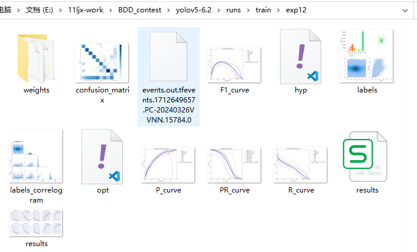


### 2.评估参数解读

在训练过程中，定期使用验证集评估模型的性能。可以计算指标如精确率P、召回率R、平均精确率均值（mAP）等来衡量模型的准确性和召回率。

#### （1）P曲线

准确度P是指所有被正确分类的物体数占总检测出的物体数的比例。即，检测出的物体中，正确分类的物体数占总数的比例。准确度越高，说明模型的分类能力越强。

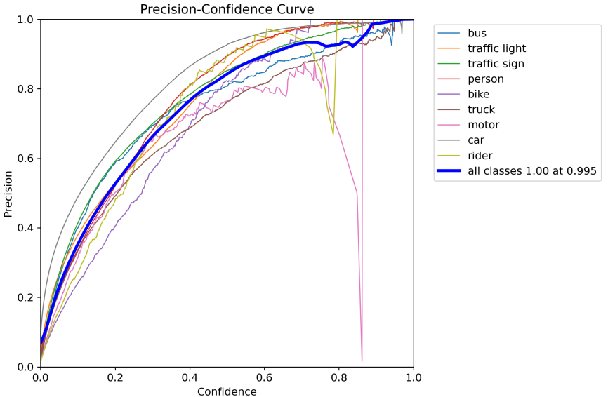

#### （2）R曲线

召回率（recall）是指正确检测出的物体数占所有实际存在的物体数的比例。即，实际存在的物体中，被正确检测出的物体数占总数的比例。召回率越高，说明模型的检测能力越强。

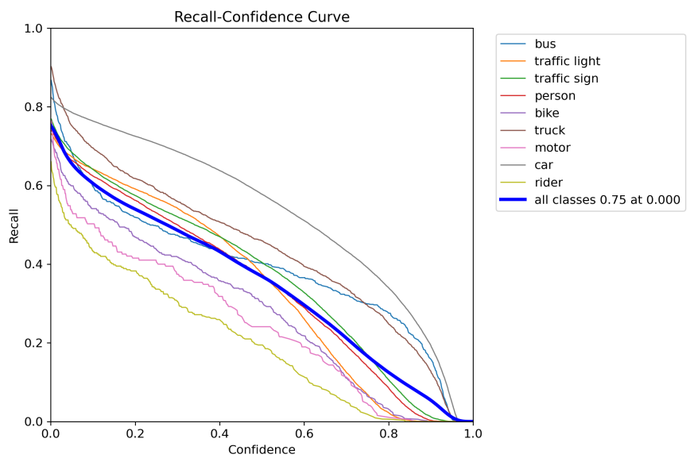


召回率（查全率）和置信度的关系图表示为当设置置信度为某一数值的时候，各个类别查全的概率。可以看到，当置信度越小的时候，类别检测的越全面。

####  （3）P-R曲线

P-R曲线即为分别以Precision与Recall为坐标围成的曲线。如下图所示：

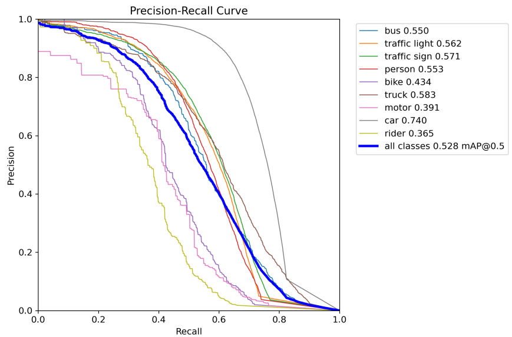

不同颜色的线代表不同类别的PR曲线，蓝色的粗线条表示所有类别平均的PR曲线

P-R曲线与坐标轴围成的面积，可作为衡量一个模型预测结果的参考。若一个模型的P-R曲线完全将另一模型的P-R曲线包裹，那么这个模型预测结果一定优于另一模型。也就是说，我们希望我们的网络，在准确率很高的前提下，尽可能的检测到全部的类别。所以希望我们的曲线接近（1，1）点，即希望mAP曲线的面积尽可能接近1。

#### （4）F1曲线

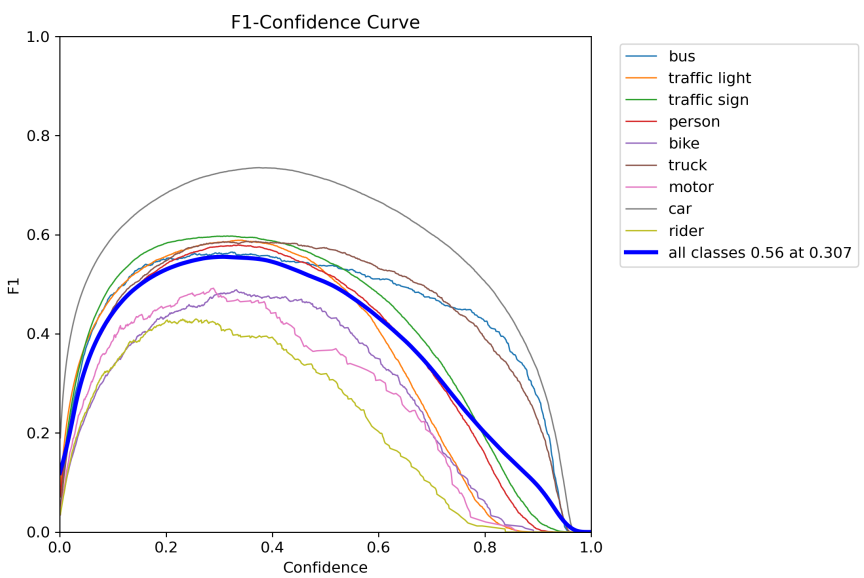

F1分数（F1-score）是分类问题的一个衡量指标。一些多分类问题的机器学习竞赛，常常将F1-score作为最终测评的方法。它是精确率和召回率的调和平均数，最大为1，最小为0。

#### （5）标签图

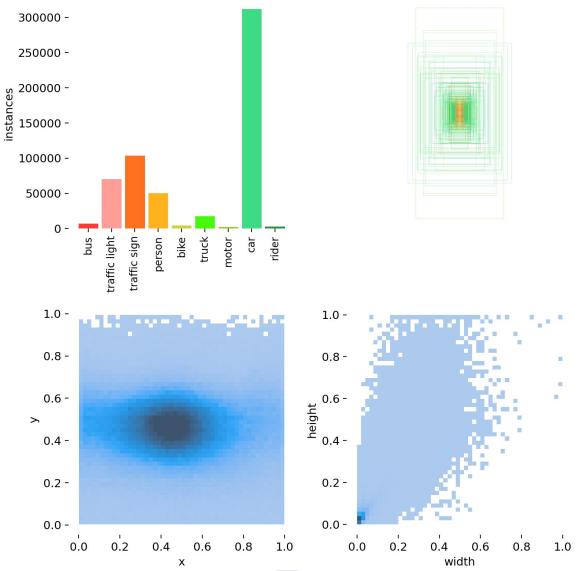


- 第一个图是训练集得数据量，每个类别有多少个
- 第二个是框的尺寸和数量
- 第三个是center点的位置。可以看到SCD数据集标签大多分布在图像的中心。
- 第四个是label的高宽，我们看到样本大多分布在（0-0.4，0-0.2）

## 拓展.训练结果

### 1.损失函数

损失函数是用来衡量模型预测值和真实值不一样的程度，极大程度上决定了模型的性能。

而YOLOv5训练时主要包含三个方面的损失

**定位损失box_loss**：预测框与标定框之间的误差（GIoU）；
**置信度损失obj_loss**：计算框的目标性；                             ----使用二元交叉熵计算
**分类损失cls_loss**：计算锚框与对应的标定分类是否正确；----使用二元交叉熵计算

在训练结束后，我们也可以在runs/train目录下找到生成对若干训练过程统计图。

### 2.训练结果图

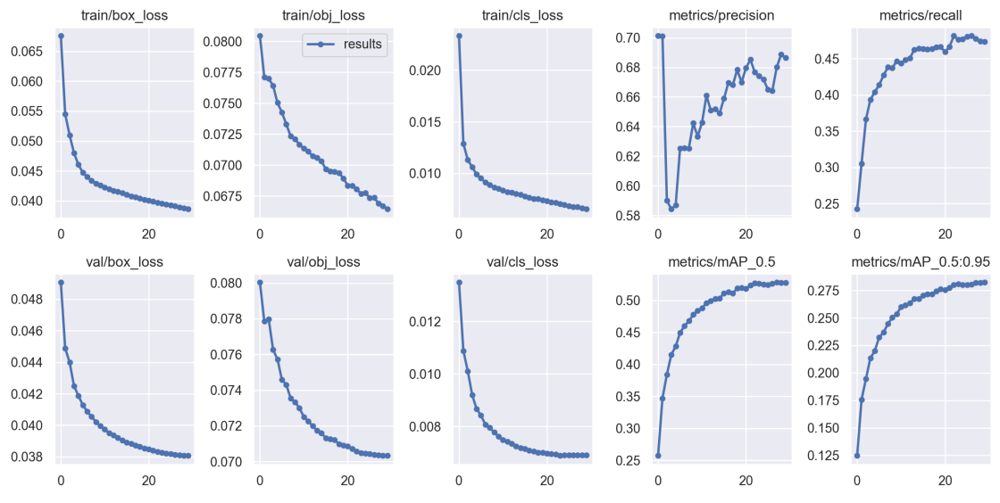

### 3.结果解读

我们可以发现，随着训练轮次的增加，训练集和验证集的损失函数都在不断下降。

针对目标检测模型的评价，一个常用的指标是IoU（Intersection over Union），它描述了我们模型预测的边界框和真实的物体定位框之间的差距，IoU函数通过计算这两个边界框的交集区域面积和并集区域面积之比来反映这一差距。一般来说，通常约定如果IoU>0.5就说明这个预测是靠谱的。如果预测的边界框和真实边界框完全重合，那IoU就是1，因此IoU是一个0～1之间的评估变量。yolov5的默认值为0.25；

当然，IoU并不能直接用来衡量多目标检测问题的算法精度，因此我们需要引入mAP（mean Average Precision），它指的是在特定的IoU阈值下计算每一类的所有图片的平均准确率。比如这里的mAP@0.5（或者记作mAP@50），就是描述了把IoU阈值设为0.5时计算每一类的所有图片的AP，再对所有类别求平均。

我们发现也对每一轮训练后的模型给出了mAP@50指标，但往往很快就达到了很高的水平，这说明仅仅考虑IoU阈值为0.5可能有些粗糙，因此YOLOv5的另一个评价指标用的是mAP@0.5:0.95，指的就是考虑把从0.5到0.95之间步长0.05的一串数（0.5、0.55、0.6、0.65、0.7、0.75、0.8、0.85、0.9、0.95）分别作为IoU阈值计算出的mAP再进行平均。

在我们的训练过程中，mAP50作为一种常用的目标检测评估指标很快达到了0.53以上，而mAP50:95也在训练的过程中不断提升，说明我们模型从训练-验证的角度表现良好。


## 七.模型推理

在训练完成后，使用测试集对最终的模型性能进行评估。测试集是一个独立于训练和验证集的数据集，用于模拟模型在实际应用中的表现。

首先在images的文件夹下创建test文件夹，在其中放入你想要测试的图片,这里选取了100张训练集的图片。

注：实际项目中的测试集一定要为没有打过标签的数据，这里因为使用的是公开数据集，所以选择训练集的部分图片作为测试集。


### 1.打开文件

打开detect.py文件

### 2.修改代码

修改219行测试集图片的路径：

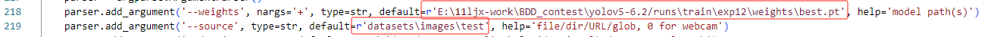

```python
    parser.add_argument('--weights', nargs='+', type=str, default=r'E:\11ljx-work\BDD_contest\yolov5-6.2/runs\train\exp12\weights\best.pt', help='model path(s)')
    parser.add_argument('--source', type=str, default=r'datasets\images\test', help='file/dir/URL/glob, 0 for webcam')
```

修改227行代码：

这里因为我们的任务是需要提交每张图片的人的总数和车的总数的csv文件，所以还需要修改的参数为：227行，将save-text设置为Ture

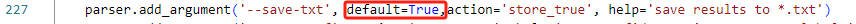

接下来我们执行脚本detect.py

最后的结果保存在： runs\detect中；

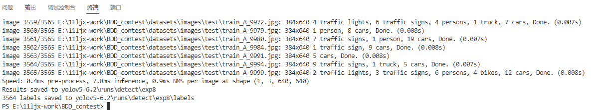

这里我们的测试图片有3565张，最后只有3564张图片，这是为什么呢？

通过观察，我们发现其中有一张图片中没有目标，所有没有标签文件。

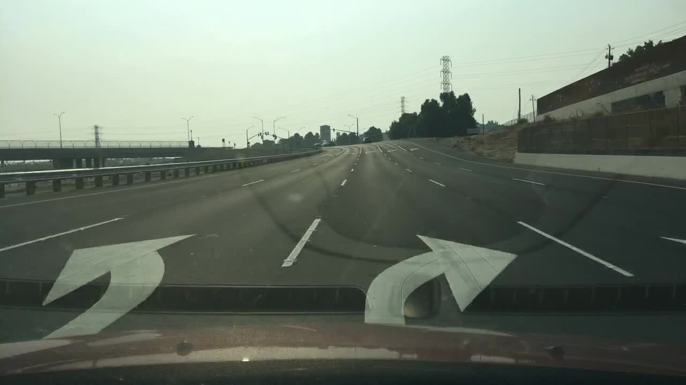

因为我们最后的结果输出需要按照顺序输出，所以处理的时候需要将这张图片的标签添加到csv文件中。


## 八.结果提交

我们得到的yolo标签如下：以train_A_1501为例

```python
2	0.404687	0.295833	0.012500	0.041667
2	0.386719	0.263889	0.045312	0.063889
2	0.434766	0.423611	0.016406	0.016667
2	0.524609	0.443056	0.014844	0.027778
2	0.481250	0.457639	0.006250	0.015278
7	0.442578	0.482639	0.010156	0.018056
7	0.433594	0.479167	0.007812	0.016667
7	0.426953	0.481944	0.007031	0.016667

```

而我们最后需要的提交文件如下：

```python
image_name	 people_num	 vehicle_num
train_A_1506	1	       17
train_A_1548	1	       10
train_A_1550	2	       16
train_A_1556	0	       17
train_A_1558	0	       15
train_A_1571	0	       11
train_A_1589	2	       7

```

因此我们需要将标签文件的txt文件转换为统计车辆和行人数量的csv文件。

这里我们需要将:

3（people）、8(rider)进行加和得到people_num的数量。

0(bus)、4(bike)、5(truck)、6(car)、7(motor)进行加和得到vehicle_num的数量


### 1.创建result.py文件

来实现上面的功能，具体如下：

```python
import os
import re
import pandas as pd

def natural_sort_key(s):
    """自然排序的辅助函数，用于对文件名进行排序"""
    return [int(text) if text.isdigit() else text.lower() for text in re.split('([0-9]+)', s)]

def summarize_labels(label_dir, output_csv):
    results = []

    # 按自然排序顺序遍历文件
    for file_name in sorted(os.listdir(label_dir), key=natural_sort_key):
        if file_name.endswith('.txt'):
            people_num = 0
            vehicle_num = 0
            with open(os.path.join(label_dir, file_name), 'r') as file:
                for line in file:
                    category = int(line.split()[0])
                    if category == 3:
                        people_num += 1
                    elif category in [0, 4, 5, 6, 7]:
                        vehicle_num += 1

            results.append({
                'image_name': file_name.replace('.txt', ''),
                'people_num': people_num,
                'vehicle_num': vehicle_num
            })

    # 将结果转换为DataFrame
    df_results = pd.DataFrame(results)

    # 保存到CSV文件
    df_results.to_csv(output_csv, index=False)
    print(f"Summary CSV has been created at {output_csv}")


# 标签文件所在目录
label_dir = r"E:\11ljx-work\BDD_contest\yolov5-6.2\runs\detect\exp7\labels"
# 输出CSV文件的路径
output_csv = r"E:\11ljx-work\BDD_contest\label_contest\test_submission.csv"

# 调用函数
summarize_labels(label_dir, output_csv)
```

结果输出如下：

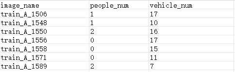


### 2.创建testgt.py文件

来创建真值文件，同样使用以上的代码，得到真值的文件如下：

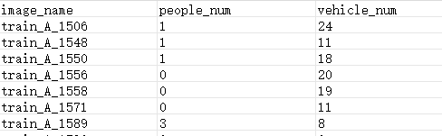

**注意：**我们将没有识别到目标的image_name为train_A_14530的标签添加到输出结果中，否则执行以下的代码会报错；

### 3.创建Accuracy.py文件

下面我们通过代码统计使用YOLOv5算法在BDD100K数据集上进行城市道路自动驾驶车辆和行人计数的正确率，

```python
import pandas as pd

# 指定文件路径
submission_path = r"E:\11ljx-work\BDD_contest\label_contest\test_submission.csv"
ground_truth_path = r"E:\11ljx-work\BDD_contest\label_contest\testgt_submission.csv"


# 加载数据
submission_df = pd.read_csv(submission_path)
ground_truth_df = pd.read_csv(ground_truth_path)

# 确保两个数据框以图像名排序，以保证数据对齐
submission_df.sort_values('image_name', inplace=True)
ground_truth_df.sort_values('image_name', inplace=True)

# 校验image_name是否一一对应
if not submission_df['image_name'].equals(ground_truth_df['image_name']):
    print("Error: The image names in the two files do not match exactly.")
    exit()

# 计算完全匹配的行数
matching_rows = (submission_df['people_num'] == ground_truth_df['people_num']) & (submission_df['vehicle_num'] == ground_truth_df['vehicle_num'])
total_correct = matching_rows.sum()

# 计算正确率
accuracy = total_correct / len(submission_df)
print(f"Overall accuracy: {accuracy:.2%}")
```

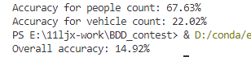


## 九.改进方法

可以看到模型的正确率仅有14.92%，这表明模型表现并不理想。以下是一些可能的改进方法，同学们可以尝试以提高模型的整体表现和正确率：

### 1. 数据预处理和增强

- **数据清洗**：确保训练数据的质量。剔除那图像质量不佳的样本。
- **增强技术**：应用图像增强技术如随机裁剪、旋转、翻转、色彩调整等，以提高模型对各种光照和天气条件的泛化能力。

### 2. 网络架构调整

- **使用更深或更复杂的模型**：这里老师使用的是YOLOv5s，同学们可以尝试使用YOLOv5m、YOLOv5l或YOLOv5x这些更大的版本。
- **特征提取器**：考虑使用不同的特征提取网络（backbone），如尝试将CSPDarknet替换为EfficientNet或其他现代网络架构。

### 3. 超参数调整

- **优化学习率和衰减策略**：调整学习率和采用更合适的学习率衰减策略（如余弦退火）可以帮助模型更好地收敛。
- **调整锚框大小**：通过分析数据集中目标的尺寸分布，自定义YOLOv5的锚框尺寸，以更好地匹配目标的实际大小。

### 4. 训练策略

- **更长的训练周期**：增加训练的轮数（epochs），这里老师作为demo只训练了30次，同学们可以增加epochs至100或者更多。
- **使用预训练模型**：使用在类似任务上预训练的模型作为起点，可以帮助加速训练过程并改善结果。

### 5. 损失函数优化

- **定制损失函数**：考虑调整或定制损失函数，尤其是在处理不平衡数据（例如行人远少于车辆）时，确保模型能给予较少类别更多关注。

### 6. 后处理技术

- **非极大抑制（NMS）**：优化NMS参数以减少重叠检测，并提高计数准确性。
- **置信度阈值调整**：调整输出置信度阈值，以平衡检测的精确度和召回率。

### 7. 进行更多的实验和评估

- **评估指标**：确保使用合适的评估指标，深入分析模型在不同类别和场景下的表现。
- **错误分析**：对模型的错误进行详细分析，查看哪类错误最常见，然后针对这些错误进行调整。

我相信同学们通过自己的不断尝试，可以不断提高模型在BDD100K数据集上进行城市道路车辆和行人检测的正确率，最后预祝同学们都能取得好成绩。


## 拓展.模型导出

在模型训练过程中保存的模型文件是包含前向预测和反向传播的过程，在实际的工业部署则不需要反向传播，因此需要将模型进行导成部署需要的模型格式。 

执行下面操作，即可导出模型。

### 1.打开文件

在yolov5的根目录下有export.py文件：

### 2.修改代码

修改export.py的第578、582行代码：

default=ROOT改为自己的yaml文件路径，device根据自己的实际情况，改为cpu,或者0；

```python
def parse_opt():
    parser = argparse.ArgumentParser()
    parser.add_argument('--data', type=str, default=ROOT / 'bdd_traina.yaml', help='dataset.yaml path')
    parser.add_argument('--weights', nargs='+', type=str, default=ROOT / 'yolov5s.pt', help='model.pt path(s)')
    parser.add_argument('--imgsz', '--img', '--img-size', nargs='+', type=int, default=[640, 640], help='image (h, w)')
    parser.add_argument('--batch-size', type=int, default=1, help='batch size')
    parser.add_argument('--device', default='0', help='cuda device, i.e. 0 or 0,1,2,3 or cpu')
```

### 3.参数介绍

每行参数具体介绍如下：

```python
def parse_opt(known=False):
    parser = argparse.ArgumentParser()
    
    # 数据集目录。改为训练模型时yaml格式数据集路径即可
    parser.add_argument('--data', type=str, default=ROOT / 'data/voc-cs.yaml', help='dataset.yaml path')
    
    # 转换后的模型文件路径
    parser.add_argument('--weights', nargs='+', type=str, default=ROOT / 'runs/train/base/weights/best.pt', help='model.pt path(s)')
    
    # 输入模型的图片size
    parser.add_argument('--imgsz', '--img', '--img-size', nargs='+', type=int, default=[640, 640], help='image (h, w)')
    parser.add_argument('--batch-size', type=int, default=1, help='batch size')
    
    # 模型运行设备:使用cpu或某gpu运行
    parser.add_argument('--device', default='0', help='cuda device, i.e. 0 or 0,1,2,3 or cpu')
    
    # 是否使用半精度FP16export转换 默认=False
    parser.add_argument('--half', action='store_true', help='FP16 half-precision export')
    
    # 是否设置YOLOv5 Detect()
    parser.add_argument('--inplace', action='store_true', help='set YOLOv5 Detect() inplace=True')
    parser.add_argument('--keras', action='store_true', help='TF: use Keras')
    
    # TorchScript转化参数,是否进行移动端优化
    parser.add_argument('--optimize', action='store_true', help='TorchScript: optimize for mobile')
    parser.add_argument('--int8', action='store_true', help='CoreML/TF INT8 quantization')
    
    # ONNX转换是否要进行批处理变量
    parser.add_argument('--dynamic', action='store_true', help='ONNX/TF/TensorRT: dynamic axes')
    
    # 是否简化onnx模型
    parser.add_argument('--simplify', action='store_true', help='ONNX: simplify model')
    #parser.add_argument('--opset', type=int, default=17, help='ONNX: opset version')
    parser.add_argument('--opset', type=int, default=12, help='ONNX: opset version')
    parser.add_argument('--verbose', action='store_true', help='TensorRT: verbose log')
    parser.add_argument('--workspace', type=int, default=4, help='TensorRT: workspace size (GB)')
    parser.add_argument('--nms', action='store_true', help='TF: add NMS to model')
    parser.add_argument('--agnostic-nms', action='store_true', help='TF: add agnostic NMS to model')
    parser.add_argument('--topk-per-class', type=int, default=100, help='TF.js NMS: topk per class to keep')
    parser.add_argument('--topk-all', type=int, default=100, help='TF.js NMS: topk for all classes to keep')
    parser.add_argument('--iou-thres', type=float, default=0.45, help='TF.js NMS: IoU threshold')
    parser.add_argument('--conf-thres', type=float, default=0.25, help='TF.js NMS: confidence threshold')
    
    # 要将pt文件转为什么格式模型
    parser.add_argument(
        '--include',
        nargs='+',
        default=['onnx'],
        help='torchscript, onnx, openvino, engine, coreml, saved_model, pb, tflite, edgetpu, tfjs, paddle')
    opt = parser.parse_known_args()[0] if known else parser.parse_args()
    print_args(vars(opt))
    return opt
```


### 4.结果可视化

通过netronhttps://netron.app网址可以进行可视化,结果如下：

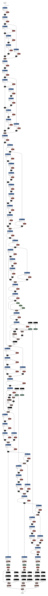

## 十.总结

### 1.一个工具

chatGPT

### 2.两个网址

github官网https://github.com/

pytorch官网https://pytorch.org/

### 3.五个实现细节

#### （1）如何下载并配置yolov5的环境

#### （2）如何处理自己的数据集适用于yolov5

新建2个脚本：label_convert.py、  split_data.py              

#### （3）如何进行模型训练

新建1个脚本：bdd_traina.yaml

修改一个脚本：train.py

#### （4）如何进行模型测试

修改一个脚本：detect.py

#### （5）如何提交结果？

新建三个脚本：reslut.py 、testgt.py、accuracy.py

